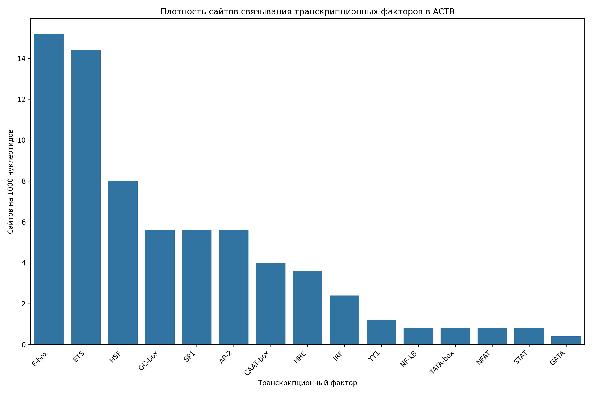

# Анализ сайтов связывания транскрипционных факторов в промоторе гена ACTB

## Общая информация

* **Длина последовательности**: 2501 нуклеотидов
* **Всего сайтов связывания**: 173
* **Количество различных транскрипционных факторов**: 15

## Распределение транскрипционных факторов

| Транскрипционный фактор | Количество сайтов | Сайтов на 1000 нуклеотидов |
|--------------------------|-------------------|------------------------------|
| E-box | 38 | 15.19 |
| ETS | 36 | 14.39 |
| HSF | 20 | 8.00 |
| GC-box | 14 | 5.60 |
| SP1 | 14 | 5.60 |
| AP-2 | 14 | 5.60 |
| CAAT-box | 10 | 4.00 |
| HRE | 9 | 3.60 |
| IRF | 6 | 2.40 |
| YY1 | 3 | 1.20 |
| TATA-box | 2 | 0.80 |
| NF-kB | 2 | 0.80 |
| STAT | 2 | 0.80 |
| NFAT | 2 | 0.80 |
| GATA | 1 | 0.40 |

## Примеры сайтов связывания

### E-box

| Позиция | Паттерн | Направление |
|---------|---------|-------------|
| 73 | CACCTG | forward |
| 264 | CAGCTG | forward |
| 282 | CAGCTG | forward |
| 803 | CACCTG | forward |
| 970 | CACATG | forward |
| 1009 | CAGATG | forward |
| 1031 | CAGCTG | forward |
| 1350 | CACCTG | forward |
| 1471 | CAGTTG | forward |
| 1593 | CACCTG | forward |

... и еще 28 сайтов

### ETS

| Позиция | Паттерн | Направление |
|---------|---------|-------------|
| 350 | GGAA | forward |
| 529 | GGAA | forward |
| 731 | GGAA | forward |
| 2193 | GGAA | forward |
| 2472 | GGAA | forward |
| 161 | TTCC | reverse |
| 449 | TTCC | reverse |
| 545 | TTCC | reverse |
| 559 | TTCC | reverse |
| 671 | TTCC | reverse |

... и еще 26 сайтов

### HSF

| Позиция | Паттерн | Направление |
|---------|---------|-------------|
| 175 | AGAAC | forward |
| 202 | AGAAG | forward |
| 837 | AGAAC | forward |
| 893 | AGAAA | forward |
| 1551 | AGAAC | forward |
| 2221 | AGAAG | forward |
| 397 | CTTCT | reverse |
| 696 | CTTCT | reverse |
| 1331 | CTTCT | reverse |
| 1534 | CTTCT | reverse |

... и еще 10 сайтов

### GC-box

| Позиция | Паттерн | Направление |
|---------|---------|-------------|
| 2317 | GGGCGG | forward |
| 68 | CCGCCC | reverse |
| 213 | CCGCCC | reverse |
| 945 | CCGCCC | reverse |
| 1103 | CCGCCC | reverse |
| 2017 | CCGCCC | reverse |
| 2055 | CCGCCC | reverse |
| 68 | CCGCCC | forward |
| 213 | CCGCCC | forward |
| 945 | CCGCCC | forward |

... и еще 4 сайтов

### SP1

| Позиция | Паттерн | Направление |
|---------|---------|-------------|
| 2317 | GGGCGG | forward |
| 68 | CCGCCC | reverse |
| 213 | CCGCCC | reverse |
| 945 | CCGCCC | reverse |
| 1103 | CCGCCC | reverse |
| 2017 | CCGCCC | reverse |
| 2055 | CCGCCC | reverse |
| 68 | CCGCCC | forward |
| 213 | CCGCCC | forward |
| 945 | CCGCCC | forward |

... и еще 4 сайтов

## Визуализации

## Выводы

1. В промоторе гена ACTB обнаружено 173 потенциальных сайтов связывания транскрипционных факторов.
2. Наиболее представленные факторы: E-box, ETS, HSF.
3. Обнаружены базовые элементы промотора: TATA-box, CAAT-box, GC-box.
4. Наличие TATA-box указывает на классический тип промотора.
5. Паттерн сайтов связывания указывает на возможную воспалительный ответ.
6. Для более детального понимания функциональной значимости обнаруженных сайтов рекомендуется экспериментальная валидация.
