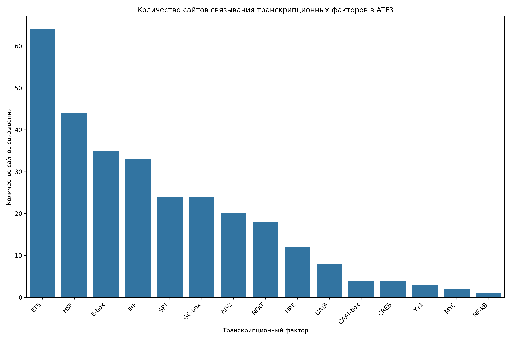

# Анализ сайтов связывания транскрипционных факторов в промоторе гена ATF3

## Общая информация

* **Длина последовательности**: 2501 нуклеотидов
* **Всего сайтов связывания**: 297
* **Количество различных транскрипционных факторов**: 16

## Распределение транскрипционных факторов

| Транскрипционный фактор | Количество сайтов | Сайтов на 1000 нуклеотидов |
|--------------------------|-------------------|------------------------------|
| ETS | 64 | 25.59 |
| HSF | 44 | 17.59 |
| E-box | 35 | 13.99 |
| IRF | 33 | 13.19 |
| GC-box | 24 | 9.60 |
| SP1 | 24 | 9.60 |
| AP-2 | 20 | 8.00 |
| NFAT | 18 | 7.20 |
| HRE | 12 | 4.80 |
| GATA | 8 | 3.20 |
| CAAT-box | 4 | 1.60 |
| CREB | 4 | 1.60 |
| YY1 | 3 | 1.20 |
| MYC | 2 | 0.80 |
| TATA-box | 1 | 0.40 |
| NF-kB | 1 | 0.40 |

## Примеры сайтов связывания

### ETS

| Позиция | Паттерн | Направление |
|---------|---------|-------------|
| 160 | GGAA | forward |
| 248 | GGAA | forward |
| 293 | GGAA | forward |
| 408 | GGAA | forward |
| 423 | GGAA | forward |
| 525 | GGAA | forward |
| 704 | GGAA | forward |
| 717 | GGAA | forward |
| 1659 | GGAA | forward |
| 1767 | GGAA | forward |

... и еще 54 сайтов

### HSF

| Позиция | Паттерн | Направление |
|---------|---------|-------------|
| 654 | AGAAG | forward |
| 686 | AGAAA | forward |
| 710 | AGAAC | forward |
| 902 | AGAAG | forward |
| 1434 | AGAAG | forward |
| 1479 | AGAAA | forward |
| 1501 | AGAAA | forward |
| 2375 | AGAAC | forward |
| 468 | TTTCT | reverse |
| 540 | TTTCT | reverse |

... и еще 34 сайтов

### E-box

| Позиция | Паттерн | Направление |
|---------|---------|-------------|
| 22 | CAAATG | forward |
| 437 | CAAGTG | forward |
| 520 | CAGGTG | forward |
| 534 | CAGGTG | forward |
| 596 | CAGGTG | forward |
| 618 | CACTTG | forward |
| 909 | CACGTG | forward |
| 1227 | CATGTG | forward |
| 1604 | CAGATG | forward |
| 1683 | CATCTG | forward |

... и еще 25 сайтов

### IRF

| Позиция | Паттерн | Направление |
|---------|---------|-------------|
| 199 | GAAAAG | forward |
| 211 | GAAAAC | forward |
| 249 | GAAATC | forward |
| 526 | GAAAGG | forward |
| 603 | GAAAGT | forward |
| 687 | GAAATT | forward |
| 718 | GAAATC | forward |
| 914 | GAAAGC | forward |
| 1480 | GAAAAT | forward |
| 1502 | GAAAGG | forward |

... и еще 23 сайтов

### GC-box

| Позиция | Паттерн | Направление |
|---------|---------|-------------|
| 113 | GGGCGG | forward |
| 1700 | GGGCGG | forward |
| 1730 | GGGCGG | forward |
| 49 | CCGCCC | reverse |
| 219 | CCGCCC | reverse |
| 340 | CCGCCC | reverse |
| 1032 | CCGCCC | reverse |
| 1421 | CCGCCC | reverse |
| 1571 | CCGCCC | reverse |
| 2050 | CCGCCC | reverse |

... и еще 14 сайтов

## Визуализации

## Выводы

1. В промоторе гена ATF3 обнаружено 297 потенциальных сайтов связывания транскрипционных факторов.
2. Наиболее представленные факторы: ETS, HSF, E-box.
3. Обнаружены базовые элементы промотора: TATA-box, CAAT-box, GC-box.
4. Наличие TATA-box указывает на классический тип промотора.
5. Паттерн сайтов связывания указывает на возможную воспалительный ответ, cAMP-зависимая регуляция.
6. Для более детального понимания функциональной значимости обнаруженных сайтов рекомендуется экспериментальная валидация.
