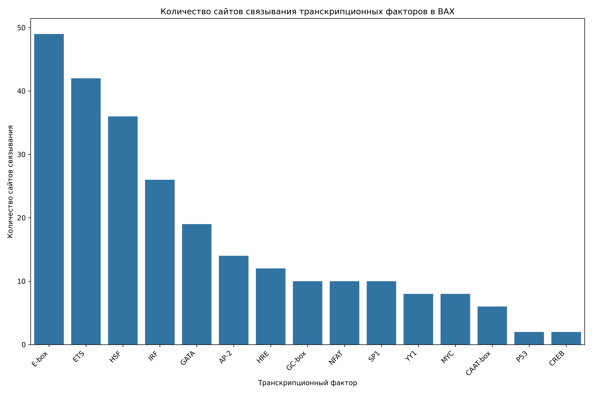
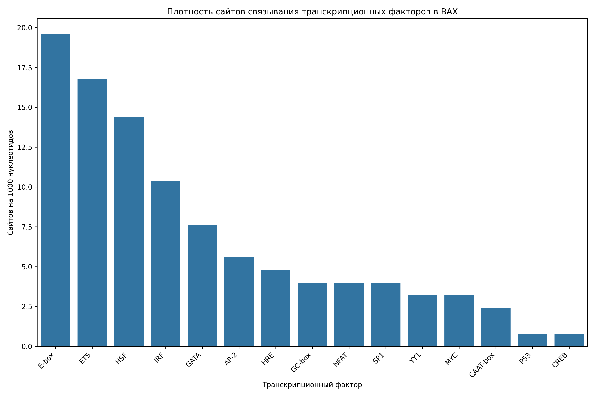

# Анализ сайтов связывания транскрипционных факторов в промоторе гена BAX

## Общая информация

* **Длина последовательности**: 2501 нуклеотидов
* **Всего сайтов связывания**: 256
* **Количество различных транскрипционных факторов**: 17

## Распределение транскрипционных факторов

| Транскрипционный фактор | Количество сайтов | Сайтов на 1000 нуклеотидов |
|--------------------------|-------------------|------------------------------|
| E-box | 49 | 19.59 |
| ETS | 42 | 16.79 |
| HSF | 36 | 14.39 |
| IRF | 26 | 10.40 |
| GATA | 19 | 7.60 |
| AP-2 | 14 | 5.60 |
| HRE | 12 | 4.80 |
| GC-box | 10 | 4.00 |
| SP1 | 10 | 4.00 |
| NFAT | 10 | 4.00 |
| YY1 | 8 | 3.20 |
| MYC | 8 | 3.20 |
| CAAT-box | 6 | 2.40 |
| CREB | 2 | 0.80 |
| P53 | 2 | 0.80 |
| TATA-box | 1 | 0.40 |
| NF-kB | 1 | 0.40 |

## Примеры сайтов связывания

### E-box

| Позиция | Паттерн | Направление |
|---------|---------|-------------|
| 33 | CAGCTG | forward |
| 220 | CAGGTG | forward |
| 236 | CACCTG | forward |
| 312 | CAGGTG | forward |
| 530 | CATCTG | forward |
| 717 | CAGGTG | forward |
| 726 | CACTTG | forward |
| 1690 | CACTTG | forward |
| 1848 | CACGTG | forward |
| 1883 | CAGGTG | forward |

... и еще 39 сайтов

### ETS

| Позиция | Паттерн | Направление |
|---------|---------|-------------|
| 400 | GGAA | forward |
| 1363 | GGAA | forward |
| 1459 | GGAA | forward |
| 1525 | GGAA | forward |
| 1657 | GGAA | forward |
| 2309 | GGAA | forward |
| 109 | TTCC | reverse |
| 186 | TTCC | reverse |
| 416 | TTCC | reverse |
| 460 | TTCC | reverse |

... и еще 32 сайтов

### HSF

| Позиция | Паттерн | Направление |
|---------|---------|-------------|
| 41 | AGAAG | forward |
| 250 | AGAAT | forward |
| 355 | AGAAG | forward |
| 392 | AGAAA | forward |
| 855 | AGAAT | forward |
| 1476 | AGAAA | forward |
| 2180 | AGAAA | forward |
| 2293 | AGAAC | forward |
| 2455 | AGAAT | forward |
| 481 | CTTCT | reverse |

... и еще 26 сайтов

### IRF

| Позиция | Паттерн | Направление |
|---------|---------|-------------|
| 8 | GAAATT | forward |
| 393 | GAAAGA | forward |
| 768 | GAAACC | forward |
| 1460 | GAAAAA | forward |
| 1477 | GAAAAG | forward |
| 1735 | GAAACT | forward |
| 2181 | GAAACT | forward |
| 106 | AGTTTC | reverse |
| 270 | GGTTTC | reverse |
| 385 | TTTTTC | reverse |

... и еще 16 сайтов

### GATA

| Позиция | Паттерн | Направление |
|---------|---------|-------------|
| 1012 | AGATAA | forward |
| 526 | TTATCA | reverse |
| 1085 | CTATCA | reverse |
| 1542 | TTATCT | reverse |
| 265 | GATA | forward |
| 1013 | GATA | forward |
| 1758 | GATA | forward |
| 2464 | GATA | forward |
| 527 | TATC | reverse |
| 1086 | TATC | reverse |

... и еще 9 сайтов

## Визуализации

## Выводы

1. В промоторе гена BAX обнаружено 256 потенциальных сайтов связывания транскрипционных факторов.
2. Наиболее представленные факторы: E-box, ETS, HSF.
3. Обнаружены базовые элементы промотора: TATA-box, CAAT-box, GC-box.
4. Наличие TATA-box указывает на классический тип промотора.
5. Паттерн сайтов связывания указывает на возможную p53-зависимая регуляция, воспалительный ответ, cAMP-зависимая регуляция.
6. Для более детального понимания функциональной значимости обнаруженных сайтов рекомендуется экспериментальная валидация.
