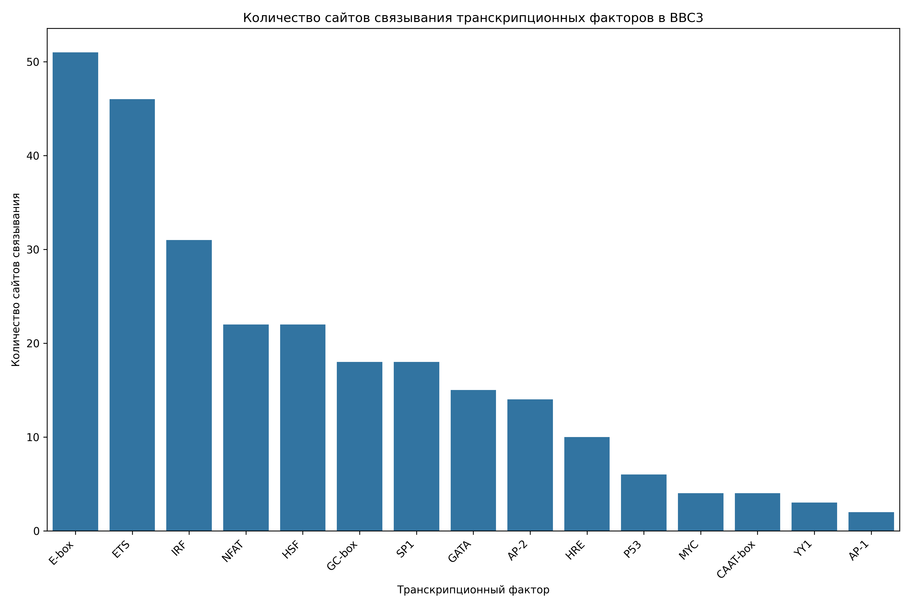
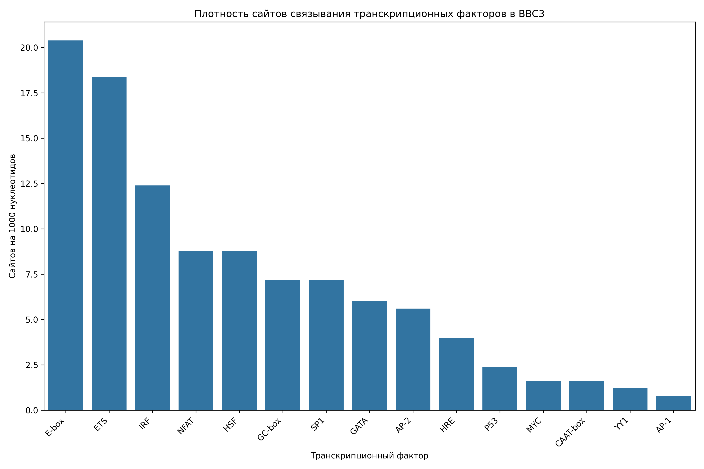

# Анализ сайтов связывания транскрипционных факторов в промоторе гена BBC3

## Общая информация

* **Длина последовательности**: 2501 нуклеотидов
* **Всего сайтов связывания**: 270
* **Количество различных транскрипционных факторов**: 17

## Распределение транскрипционных факторов

| Транскрипционный фактор | Количество сайтов | Сайтов на 1000 нуклеотидов |
|--------------------------|-------------------|------------------------------|
| E-box | 51 | 20.39 |
| ETS | 46 | 18.39 |
| IRF | 31 | 12.40 |
| NFAT | 22 | 8.80 |
| HSF | 22 | 8.80 |
| GC-box | 18 | 7.20 |
| SP1 | 18 | 7.20 |
| GATA | 15 | 6.00 |
| AP-2 | 14 | 5.60 |
| HRE | 10 | 4.00 |
| P53 | 6 | 2.40 |
| CAAT-box | 4 | 1.60 |
| MYC | 4 | 1.60 |
| YY1 | 3 | 1.20 |
| AP-1 | 2 | 0.80 |
| NF-kB | 2 | 0.80 |
| CREB | 2 | 0.80 |

## Примеры сайтов связывания

### E-box

| Позиция | Паттерн | Направление |
|---------|---------|-------------|
| 146 | CATATG | forward |
| 286 | CAAATG | forward |
| 301 | CACGTG | forward |
| 637 | CAGGTG | forward |
| 697 | CAGGTG | forward |
| 751 | CAGGTG | forward |
| 768 | CATGTG | forward |
| 1182 | CATTTG | forward |
| 1246 | CAGGTG | forward |
| 1399 | CAGGTG | forward |

... и еще 41 сайтов

### ETS

| Позиция | Паттерн | Направление |
|---------|---------|-------------|
| 186 | GGAA | forward |
| 197 | GGAA | forward |
| 204 | GGAA | forward |
| 226 | GGAA | forward |
| 243 | GGAA | forward |
| 260 | GGAA | forward |
| 414 | GGAA | forward |
| 469 | GGAA | forward |
| 488 | GGAA | forward |
| 503 | GGAA | forward |

... и еще 36 сайтов

### IRF

| Позиция | Паттерн | Направление |
|---------|---------|-------------|
| 187 | GAAAAC | forward |
| 227 | GAAAGC | forward |
| 233 | GAAAGA | forward |
| 244 | GAAAGT | forward |
| 250 | GAAAGA | forward |
| 261 | GAAAGC | forward |
| 470 | GAAAGT | forward |
| 504 | GAAAAA | forward |
| 558 | GAAACT | forward |
| 564 | GAAAAA | forward |

... и еще 21 сайтов

### NFAT

| Позиция | Паттерн | Направление |
|---------|---------|-------------|
| 186 | GGAAA | forward |
| 226 | GGAAA | forward |
| 243 | GGAAA | forward |
| 260 | GGAAA | forward |
| 469 | GGAAA | forward |
| 503 | GGAAA | forward |
| 580 | GGAAA | forward |
| 1819 | GGAAA | forward |
| 830 | TTTCC | reverse |
| 1297 | TTTCC | reverse |

... и еще 12 сайтов

### HSF

| Позиция | Паттерн | Направление |
|---------|---------|-------------|
| 14 | AGAAG | forward |
| 200 | AGAAG | forward |
| 371 | AGAAG | forward |
| 557 | AGAAA | forward |
| 569 | AGAAA | forward |
| 740 | AGAAG | forward |
| 785 | TTTCT | reverse |
| 826 | TTTCT | reverse |
| 936 | GTTCT | reverse |
| 1139 | TTTCT | reverse |

... и еще 12 сайтов

## Визуализации

## Выводы

1. В промоторе гена BBC3 обнаружено 270 потенциальных сайтов связывания транскрипционных факторов.
2. Наиболее представленные факторы: E-box, ETS, IRF.
3. Обнаружены базовые элементы промотора: CAAT-box, GC-box.
4. Обогащение GC-box/SP1 сайтами характерно для CpG-островков и конститутивно экспрессирующихся генов.
5. Паттерн сайтов связывания указывает на возможную p53-зависимая регуляция, воспалительный ответ, cAMP-зависимая регуляция, реакция на клеточный стресс.
6. Для более детального понимания функциональной значимости обнаруженных сайтов рекомендуется экспериментальная валидация.
