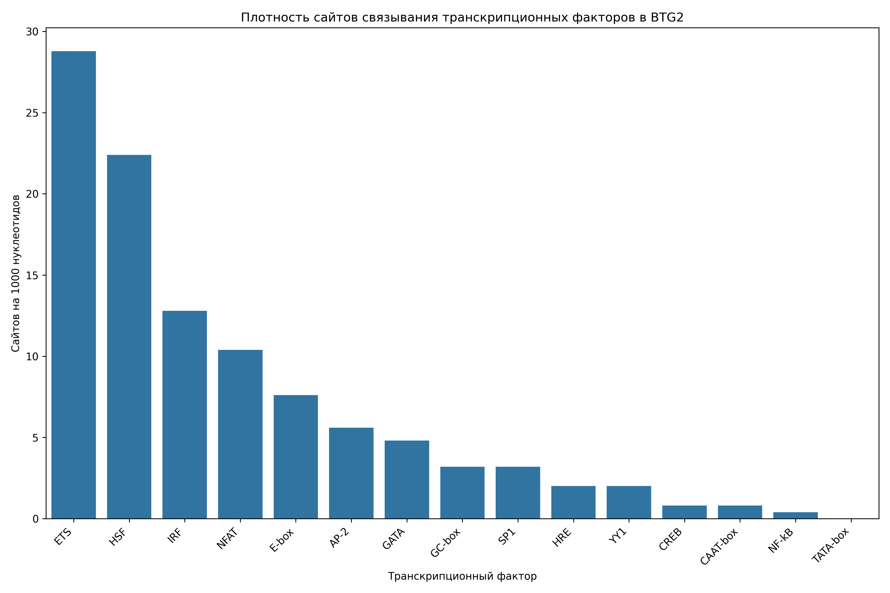

# Анализ сайтов связывания транскрипционных факторов в промоторе гена BTG2

## Общая информация

* **Длина последовательности**: 2501 нуклеотидов
* **Всего сайтов связывания**: 262
* **Количество различных транскрипционных факторов**: 14

## Распределение транскрипционных факторов

| Транскрипционный фактор | Количество сайтов | Сайтов на 1000 нуклеотидов |
|--------------------------|-------------------|------------------------------|
| ETS | 72 | 28.79 |
| HSF | 56 | 22.39 |
| IRF | 32 | 12.79 |
| NFAT | 26 | 10.40 |
| E-box | 19 | 7.60 |
| AP-2 | 14 | 5.60 |
| GATA | 12 | 4.80 |
| GC-box | 8 | 3.20 |
| SP1 | 8 | 3.20 |
| HRE | 5 | 2.00 |
| YY1 | 5 | 2.00 |
| CAAT-box | 2 | 0.80 |
| CREB | 2 | 0.80 |
| NF-kB | 1 | 0.40 |

## Примеры сайтов связывания

### ETS

| Позиция | Паттерн | Направление |
|---------|---------|-------------|
| 6 | GGAA | forward |
| 144 | GGAA | forward |
| 398 | GGAA | forward |
| 414 | GGAA | forward |
| 419 | GGAA | forward |
| 437 | GGAA | forward |
| 570 | GGAA | forward |
| 683 | GGAA | forward |
| 699 | GGAA | forward |
| 789 | GGAA | forward |

... и еще 62 сайтов

### HSF

| Позиция | Паттерн | Направление |
|---------|---------|-------------|
| 238 | AGAAG | forward |
| 370 | AGAAT | forward |
| 387 | AGAAG | forward |
| 466 | AGAAT | forward |
| 494 | AGAAG | forward |
| 591 | AGAAA | forward |
| 729 | AGAAA | forward |
| 804 | AGAAA | forward |
| 890 | AGAAG | forward |
| 933 | AGAAG | forward |

... и еще 46 сайтов

### IRF

| Позиция | Паттерн | Направление |
|---------|---------|-------------|
| 571 | GAAATG | forward |
| 592 | GAAATG | forward |
| 700 | GAAAGA | forward |
| 730 | GAAAAG | forward |
| 790 | GAAAGG | forward |
| 805 | GAAAAG | forward |
| 908 | GAAAAA | forward |
| 963 | GAAAAT | forward |
| 1211 | GAAAAA | forward |
| 1266 | GAAAGT | forward |

... и еще 22 сайтов

### NFAT

| Позиция | Паттерн | Направление |
|---------|---------|-------------|
| 570 | GGAAA | forward |
| 699 | GGAAA | forward |
| 789 | GGAAA | forward |
| 907 | GGAAA | forward |
| 962 | GGAAA | forward |
| 1210 | GGAAA | forward |
| 1265 | GGAAA | forward |
| 1420 | GGAAA | forward |
| 1550 | GGAAA | forward |
| 1860 | GGAAA | forward |

... и еще 16 сайтов

### E-box

| Позиция | Паттерн | Направление |
|---------|---------|-------------|
| 282 | CAGATG | forward |
| 656 | CATCTG | forward |
| 723 | CAGATG | forward |
| 1015 | CATCTG | forward |
| 1223 | CAGTTG | forward |
| 2228 | CAGGTG | forward |
| 282 | CAGATG | reverse |
| 656 | CATCTG | reverse |
| 723 | CAGATG | reverse |
| 1015 | CATCTG | reverse |

... и еще 9 сайтов

## Визуализации

## Выводы

1. В промоторе гена BTG2 обнаружено 262 потенциальных сайтов связывания транскрипционных факторов.
2. Наиболее представленные факторы: ETS, HSF, IRF.
3. Обнаружены базовые элементы промотора: CAAT-box, GC-box.
4. Обогащение GC-box/SP1 сайтами характерно для CpG-островков и конститутивно экспрессирующихся генов.
5. Паттерн сайтов связывания указывает на возможную воспалительный ответ, cAMP-зависимая регуляция.
6. Для более детального понимания функциональной значимости обнаруженных сайтов рекомендуется экспериментальная валидация.
