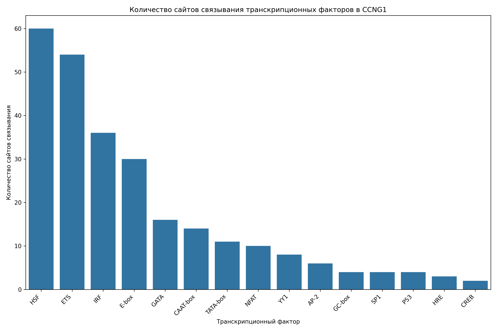

# Анализ сайтов связывания транскрипционных факторов в промоторе гена CCNG1

## Общая информация

* **Длина последовательности**: 2501 нуклеотидов
* **Всего сайтов связывания**: 264
* **Количество различных транскрипционных факторов**: 16

## Распределение транскрипционных факторов

| Транскрипционный фактор | Количество сайтов | Сайтов на 1000 нуклеотидов |
|--------------------------|-------------------|------------------------------|
| HSF | 60 | 23.99 |
| ETS | 54 | 21.59 |
| IRF | 36 | 14.39 |
| E-box | 30 | 12.00 |
| GATA | 16 | 6.40 |
| CAAT-box | 14 | 5.60 |
| TATA-box | 11 | 4.40 |
| NFAT | 10 | 4.00 |
| YY1 | 8 | 3.20 |
| AP-2 | 6 | 2.40 |
| GC-box | 4 | 1.60 |
| SP1 | 4 | 1.60 |
| P53 | 4 | 1.60 |
| HRE | 3 | 1.20 |
| CREB | 2 | 0.80 |
| MYC | 2 | 0.80 |

## Примеры сайтов связывания

### HSF

| Позиция | Паттерн | Направление |
|---------|---------|-------------|
| 11 | AGAAA | forward |
| 16 | AGAAA | forward |
| 236 | AGAAT | forward |
| 637 | AGAAA | forward |
| 1008 | AGAAC | forward |
| 1049 | AGAAA | forward |
| 1144 | AGAAG | forward |
| 1376 | AGAAA | forward |
| 1396 | AGAAA | forward |
| 1455 | AGAAT | forward |

... и еще 50 сайтов

### ETS

| Позиция | Паттерн | Направление |
|---------|---------|-------------|
| 602 | GGAA | forward |
| 609 | GGAA | forward |
| 618 | GGAA | forward |
| 753 | GGAA | forward |
| 1495 | GGAA | forward |
| 1659 | GGAA | forward |
| 1804 | GGAA | forward |
| 1817 | GGAA | forward |
| 1838 | GGAA | forward |
| 2435 | GGAA | forward |

... и еще 44 сайтов

### IRF

| Позиция | Паттерн | Направление |
|---------|---------|-------------|
| 12 | GAAAAG | forward |
| 41 | GAAAGT | forward |
| 638 | GAAACT | forward |
| 1050 | GAAATG | forward |
| 1327 | GAAAAA | forward |
| 1377 | GAAAAT | forward |
| 1397 | GAAATT | forward |
| 1599 | GAAAGA | forward |
| 1935 | GAAAAT | forward |
| 1956 | GAAAGC | forward |

... и еще 26 сайтов

### E-box

| Позиция | Паттерн | Направление |
|---------|---------|-------------|
| 378 | CACGTG | forward |
| 692 | CACTTG | forward |
| 772 | CATTTG | forward |
| 1088 | CAAATG | forward |
| 1103 | CACTTG | forward |
| 1322 | CAACTG | forward |
| 1460 | CAACTG | forward |
| 2240 | CAGGTG | forward |
| 2468 | CACATG | forward |
| 378 | CACGTG | reverse |

... и еще 20 сайтов

### GATA

| Позиция | Паттерн | Направление |
|---------|---------|-------------|
| 1424 | TGATAA | forward |
| 1501 | TGATAA | forward |
| 1830 | AGATAA | forward |
| 1538 | TTATCT | reverse |
| 74 | GATA | forward |
| 1425 | GATA | forward |
| 1502 | GATA | forward |
| 1664 | GATA | forward |
| 1831 | GATA | forward |
| 2141 | GATA | forward |

... и еще 6 сайтов

## Визуализации

## Выводы

1. В промоторе гена CCNG1 обнаружено 264 потенциальных сайтов связывания транскрипционных факторов.
2. Наиболее представленные факторы: HSF, ETS, IRF.
3. Обнаружены базовые элементы промотора: TATA-box, CAAT-box, GC-box.
4. Наличие TATA-box указывает на классический тип промотора.
5. Паттерн сайтов связывания указывает на возможную p53-зависимая регуляция, cAMP-зависимая регуляция.
6. Для более детального понимания функциональной значимости обнаруженных сайтов рекомендуется экспериментальная валидация.
