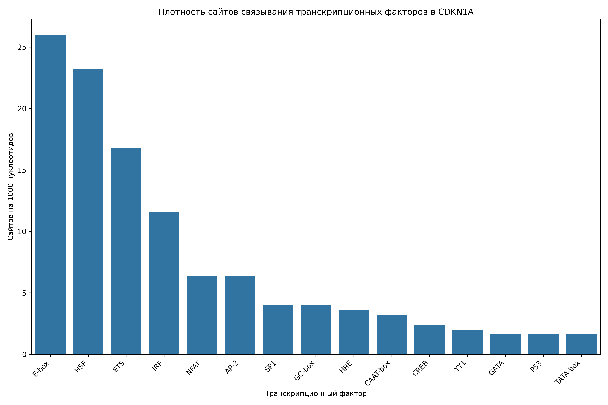

# Анализ сайтов связывания транскрипционных факторов в промоторе гена CDKN1A

## Общая информация

* **Длина последовательности**: 2501 нуклеотидов
* **Всего сайтов связывания**: 288
* **Количество различных транскрипционных факторов**: 16

## Распределение транскрипционных факторов

| Транскрипционный фактор | Количество сайтов | Сайтов на 1000 нуклеотидов |
|--------------------------|-------------------|------------------------------|
| E-box | 65 | 25.99 |
| HSF | 58 | 23.19 |
| ETS | 42 | 16.79 |
| IRF | 29 | 11.60 |
| NFAT | 16 | 6.40 |
| AP-2 | 16 | 6.40 |
| GC-box | 10 | 4.00 |
| SP1 | 10 | 4.00 |
| HRE | 9 | 3.60 |
| CAAT-box | 8 | 3.20 |
| CREB | 6 | 2.40 |
| YY1 | 5 | 2.00 |
| TATA-box | 4 | 1.60 |
| GATA | 4 | 1.60 |
| P53 | 4 | 1.60 |
| STAT | 2 | 0.80 |

## Примеры сайтов связывания

### E-box

| Позиция | Паттерн | Направление |
|---------|---------|-------------|
| 53 | CAAGTG | forward |
| 370 | CATTTG | forward |
| 604 | CAGCTG | forward |
| 729 | CAGATG | forward |
| 773 | CAAATG | forward |
| 934 | CATCTG | forward |
| 940 | CAAATG | forward |
| 1218 | CAGGTG | forward |
| 1328 | CATGTG | forward |
| 1381 | CATCTG | forward |

... и еще 55 сайтов

### HSF

| Позиция | Паттерн | Направление |
|---------|---------|-------------|
| 17 | AGAAG | forward |
| 120 | AGAAA | forward |
| 152 | AGAAG | forward |
| 194 | AGAAT | forward |
| 346 | AGAAG | forward |
| 578 | AGAAA | forward |
| 620 | AGAAG | forward |
| 789 | AGAAA | forward |
| 878 | AGAAG | forward |
| 900 | AGAAT | forward |

... и еще 48 сайтов

### ETS

| Позиция | Паттерн | Направление |
|---------|---------|-------------|
| 617 | GGAA | forward |
| 1323 | GGAA | forward |
| 1492 | GGAA | forward |
| 1522 | GGAA | forward |
| 1741 | GGAA | forward |
| 1788 | GGAA | forward |
| 1837 | GGAA | forward |
| 2348 | GGAA | forward |
| 2376 | GGAA | forward |
| 173 | TTCC | reverse |

... и еще 32 сайтов

### IRF

| Позиция | Паттерн | Направление |
|---------|---------|-------------|
| 121 | GAAATA | forward |
| 309 | GAAATG | forward |
| 318 | GAAAGC | forward |
| 579 | GAAAGA | forward |
| 790 | GAAAGG | forward |
| 982 | GAAATA | forward |
| 1388 | GAAATA | forward |
| 1403 | GAAAAA | forward |
| 1523 | GAAATT | forward |
| 1647 | GAAAGG | forward |

... и еще 19 сайтов

### NFAT

| Позиция | Паттерн | Направление |
|---------|---------|-------------|
| 1522 | GGAAA | forward |
| 1741 | GGAAA | forward |
| 2376 | GGAAA | forward |
| 172 | TTTCC | reverse |
| 647 | TTTCC | reverse |
| 1100 | TTTCC | reverse |
| 1267 | TTTCC | reverse |
| 1375 | TTTCC | reverse |
| 172 | TTTCC | forward |
| 647 | TTTCC | forward |

... и еще 6 сайтов

## Визуализации

## Выводы

1. В промоторе гена CDKN1A обнаружено 288 потенциальных сайтов связывания транскрипционных факторов.
2. Наиболее представленные факторы: E-box, HSF, ETS.
3. Обнаружены базовые элементы промотора: TATA-box, CAAT-box, GC-box.
4. Наличие TATA-box указывает на классический тип промотора.
5. Паттерн сайтов связывания указывает на возможную p53-зависимая регуляция, cAMP-зависимая регуляция.
6. Для более детального понимания функциональной значимости обнаруженных сайтов рекомендуется экспериментальная валидация.
