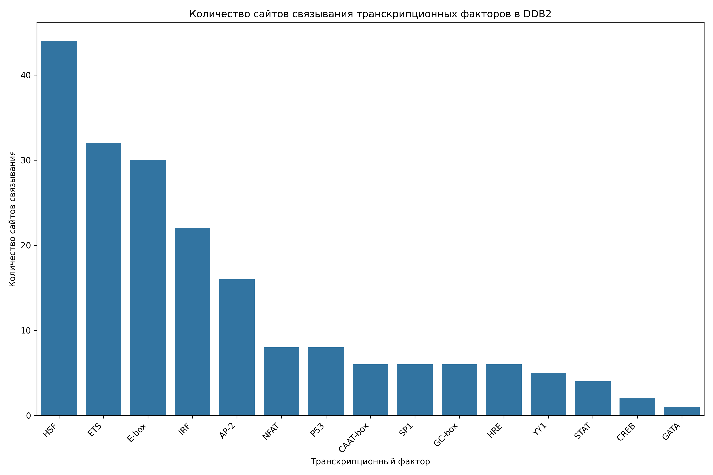
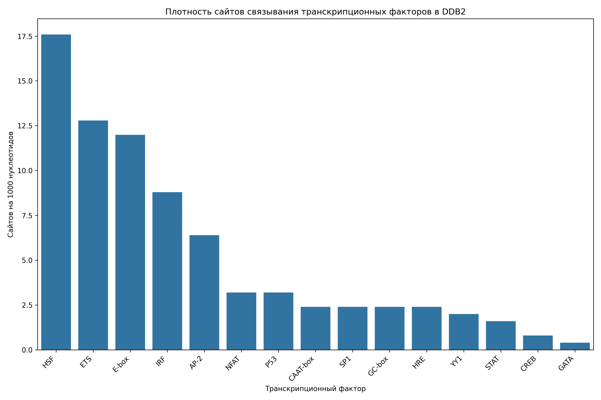

# Анализ сайтов связывания транскрипционных факторов в промоторе гена DDB2

## Общая информация

* **Длина последовательности**: 2501 нуклеотидов
* **Всего сайтов связывания**: 197
* **Количество различных транскрипционных факторов**: 16

## Распределение транскрипционных факторов

| Транскрипционный фактор | Количество сайтов | Сайтов на 1000 нуклеотидов |
|--------------------------|-------------------|------------------------------|
| HSF | 44 | 17.59 |
| ETS | 32 | 12.79 |
| E-box | 30 | 12.00 |
| IRF | 22 | 8.80 |
| AP-2 | 16 | 6.40 |
| NFAT | 8 | 3.20 |
| P53 | 8 | 3.20 |
| CAAT-box | 6 | 2.40 |
| GC-box | 6 | 2.40 |
| SP1 | 6 | 2.40 |
| HRE | 6 | 2.40 |
| YY1 | 5 | 2.00 |
| STAT | 4 | 1.60 |
| CREB | 2 | 0.80 |
| TATA-box | 1 | 0.40 |
| GATA | 1 | 0.40 |

## Примеры сайтов связывания

### HSF

| Позиция | Паттерн | Направление |
|---------|---------|-------------|
| 30 | AGAAA | forward |
| 319 | AGAAG | forward |
| 850 | AGAAA | forward |
| 858 | AGAAA | forward |
| 866 | AGAAA | forward |
| 916 | AGAAC | forward |
| 1257 | AGAAG | forward |
| 1607 | AGAAA | forward |
| 1613 | AGAAA | forward |
| 1635 | AGAAA | forward |

... и еще 34 сайтов

### ETS

| Позиция | Паттерн | Направление |
|---------|---------|-------------|
| 438 | GGAA | forward |
| 757 | GGAA | forward |
| 1010 | GGAA | forward |
| 1177 | GGAA | forward |
| 1198 | GGAA | forward |
| 1292 | GGAA | forward |
| 1341 | GGAA | forward |
| 1529 | GGAA | forward |
| 1946 | GGAA | forward |
| 2022 | GGAA | forward |

... и еще 22 сайтов

### E-box

| Позиция | Паттерн | Направление |
|---------|---------|-------------|
| 87 | CACCTG | forward |
| 413 | CAGCTG | forward |
| 579 | CACCTG | forward |
| 706 | CACCTG | forward |
| 979 | CACTTG | forward |
| 1431 | CAATTG | forward |
| 1843 | CAGCTG | forward |
| 2478 | CAGATG | forward |
| 87 | CACCTG | reverse |
| 413 | CAGCTG | reverse |

... и еще 20 сайтов

### IRF

| Позиция | Паттерн | Направление |
|---------|---------|-------------|
| 31 | GAAACT | forward |
| 350 | GAAACC | forward |
| 851 | GAAAGA | forward |
| 859 | GAAAGA | forward |
| 867 | GAAAGA | forward |
| 1011 | GAAACA | forward |
| 1115 | GAAACT | forward |
| 1199 | GAAAAA | forward |
| 1342 | GAAAGG | forward |
| 1608 | GAAAAA | forward |

... и еще 12 сайтов

### AP-2

| Позиция | Паттерн | Направление |
|---------|---------|-------------|
| 2003 | GCCCTGGGC | forward |
| 2247 | GCCCGAGGC | forward |
| 2394 | GCCTCCGGC | forward |
| 2003 | GCCCTGGGC | reverse |
| 2247 | GCCCGAGGC | reverse |
| 2394 | GCCTCCGGC | reverse |
| 294 | GCCGAGGC | forward |
| 500 | GCCTGGGC | forward |
| 639 | GCCTAGGC | forward |
| 1453 | GCCTTGGC | forward |

... и еще 6 сайтов

## Визуализации

## Выводы

1. В промоторе гена DDB2 обнаружено 197 потенциальных сайтов связывания транскрипционных факторов.
2. Наиболее представленные факторы: HSF, ETS, E-box.
3. Обнаружены базовые элементы промотора: TATA-box, CAAT-box, GC-box.
4. Наличие TATA-box указывает на классический тип промотора.
5. Паттерн сайтов связывания указывает на возможную p53-зависимая регуляция, cAMP-зависимая регуляция.
6. Для более детального понимания функциональной значимости обнаруженных сайтов рекомендуется экспериментальная валидация.
