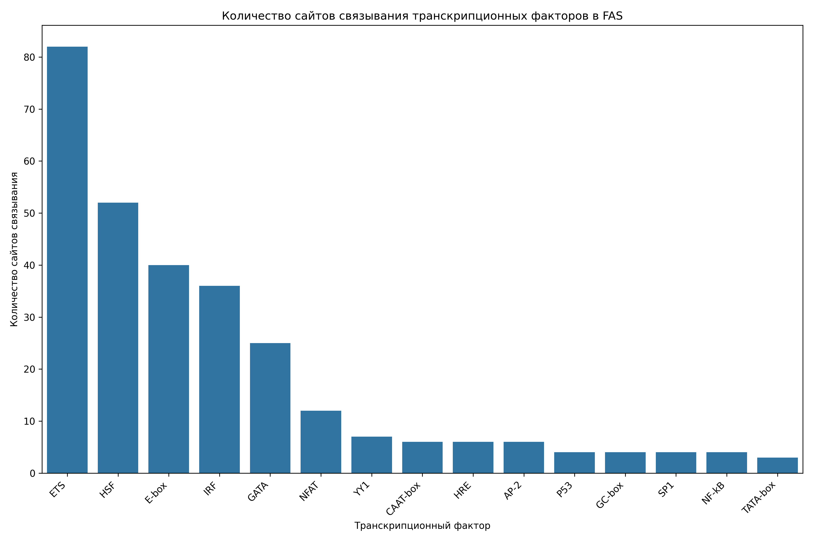

# Анализ сайтов связывания транскрипционных факторов в промоторе гена FAS

## Общая информация

* **Длина последовательности**: 2501 нуклеотидов
* **Всего сайтов связывания**: 291
* **Количество различных транскрипционных факторов**: 15

## Распределение транскрипционных факторов

| Транскрипционный фактор | Количество сайтов | Сайтов на 1000 нуклеотидов |
|--------------------------|-------------------|------------------------------|
| ETS | 82 | 32.79 |
| HSF | 52 | 20.79 |
| E-box | 40 | 15.99 |
| IRF | 36 | 14.39 |
| GATA | 25 | 10.00 |
| NFAT | 12 | 4.80 |
| YY1 | 7 | 2.80 |
| CAAT-box | 6 | 2.40 |
| HRE | 6 | 2.40 |
| AP-2 | 6 | 2.40 |
| GC-box | 4 | 1.60 |
| NF-kB | 4 | 1.60 |
| SP1 | 4 | 1.60 |
| P53 | 4 | 1.60 |
| TATA-box | 3 | 1.20 |

## Примеры сайтов связывания

### ETS

| Позиция | Паттерн | Направление |
|---------|---------|-------------|
| 188 | GGAA | forward |
| 380 | GGAA | forward |
| 573 | GGAA | forward |
| 739 | GGAA | forward |
| 813 | GGAA | forward |
| 888 | GGAA | forward |
| 960 | GGAA | forward |
| 1013 | GGAA | forward |
| 1044 | GGAA | forward |
| 1219 | GGAA | forward |

... и еще 72 сайтов

### HSF

| Позиция | Паттерн | Направление |
|---------|---------|-------------|
| 39 | AGAAG | forward |
| 54 | AGAAA | forward |
| 80 | AGAAT | forward |
| 205 | AGAAA | forward |
| 229 | AGAAT | forward |
| 616 | AGAAT | forward |
| 867 | AGAAG | forward |
| 1183 | AGAAT | forward |
| 1206 | AGAAA | forward |
| 1318 | AGAAA | forward |

... и еще 42 сайтов

### E-box

| Позиция | Паттерн | Направление |
|---------|---------|-------------|
| 110 | CATATG | forward |
| 390 | CATATG | forward |
| 441 | CAATTG | forward |
| 791 | CAGATG | forward |
| 879 | CAACTG | forward |
| 1366 | CATCTG | forward |
| 1380 | CATATG | forward |
| 1453 | CAAATG | forward |
| 1626 | CACCTG | forward |
| 1679 | CATTTG | forward |

... и еще 30 сайтов

### IRF

| Позиция | Паттерн | Направление |
|---------|---------|-------------|
| 55 | GAAAGT | forward |
| 106 | GAAACA | forward |
| 206 | GAAAGA | forward |
| 732 | GAAAGG | forward |
| 814 | GAAAGC | forward |
| 871 | GAAAAT | forward |
| 1021 | GAAACC | forward |
| 1180 | GAAAGA | forward |
| 1207 | GAAAAT | forward |
| 1220 | GAAATA | forward |

... и еще 26 сайтов

### GATA

| Позиция | Паттерн | Направление |
|---------|---------|-------------|
| 363 | TGATAA | forward |
| 605 | AGATAA | forward |
| 138 | CTATCT | reverse |
| 754 | CTATCA | reverse |
| 1128 | CTATCT | reverse |
| 157 | GATA | forward |
| 364 | GATA | forward |
| 427 | GATA | forward |
| 606 | GATA | forward |
| 2154 | GATA | forward |

... и еще 15 сайтов

## Визуализации

## Выводы

1. В промоторе гена FAS обнаружено 291 потенциальных сайтов связывания транскрипционных факторов.
2. Наиболее представленные факторы: ETS, HSF, E-box.
3. Обнаружены базовые элементы промотора: TATA-box, CAAT-box, GC-box.
4. Наличие TATA-box указывает на классический тип промотора.
5. Паттерн сайтов связывания указывает на возможную p53-зависимая регуляция, воспалительный ответ.
6. Для более детального понимания функциональной значимости обнаруженных сайтов рекомендуется экспериментальная валидация.
