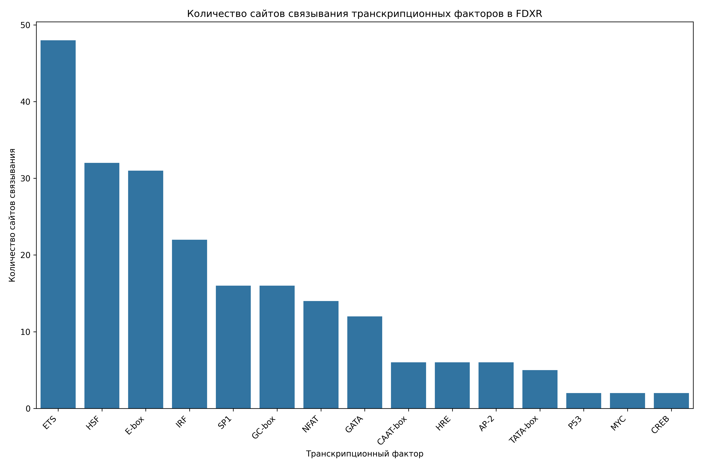

# Анализ сайтов связывания транскрипционных факторов в промоторе гена FDXR

## Общая информация

* **Длина последовательности**: 2501 нуклеотидов
* **Всего сайтов связывания**: 222
* **Количество различных транскрипционных факторов**: 17

## Распределение транскрипционных факторов

| Транскрипционный фактор | Количество сайтов | Сайтов на 1000 нуклеотидов |
|--------------------------|-------------------|------------------------------|
| ETS | 48 | 19.19 |
| HSF | 32 | 12.79 |
| E-box | 31 | 12.40 |
| IRF | 22 | 8.80 |
| GC-box | 16 | 6.40 |
| SP1 | 16 | 6.40 |
| NFAT | 14 | 5.60 |
| GATA | 12 | 4.80 |
| CAAT-box | 6 | 2.40 |
| HRE | 6 | 2.40 |
| AP-2 | 6 | 2.40 |
| TATA-box | 5 | 2.00 |
| CREB | 2 | 0.80 |
| P53 | 2 | 0.80 |
| MYC | 2 | 0.80 |
| NF-kB | 1 | 0.40 |
| YY1 | 1 | 0.40 |

## Примеры сайтов связывания

### ETS

| Позиция | Паттерн | Направление |
|---------|---------|-------------|
| 296 | GGAA | forward |
| 469 | GGAA | forward |
| 746 | GGAA | forward |
| 961 | GGAA | forward |
| 985 | GGAA | forward |
| 1026 | GGAA | forward |
| 1056 | GGAA | forward |
| 1062 | GGAA | forward |
| 1344 | GGAA | forward |
| 1470 | GGAA | forward |

... и еще 38 сайтов

### HSF

| Позиция | Паттерн | Направление |
|---------|---------|-------------|
| 143 | AGAAG | forward |
| 708 | AGAAA | forward |
| 1009 | AGAAA | forward |
| 1448 | AGAAG | forward |
| 1770 | AGAAA | forward |
| 2201 | AGAAG | forward |
| 601 | ATTCT | reverse |
| 798 | TTTCT | reverse |
| 875 | TTTCT | reverse |
| 1017 | CTTCT | reverse |

... и еще 22 сайтов

### E-box

| Позиция | Паттерн | Направление |
|---------|---------|-------------|
| 74 | CATATG | forward |
| 98 | CAATTG | forward |
| 411 | CACCTG | forward |
| 951 | CAGATG | forward |
| 1087 | CAGCTG | forward |
| 1568 | CACGTG | forward |
| 1588 | CAAATG | forward |
| 2006 | CACTTG | forward |
| 2347 | CAGGTG | forward |
| 74 | CATATG | reverse |

... и еще 21 сайтов

### IRF

| Позиция | Паттерн | Направление |
|---------|---------|-------------|
| 709 | GAAAGC | forward |
| 1010 | GAAAAG | forward |
| 1057 | GAAAAG | forward |
| 1345 | GAAAGG | forward |
| 1698 | GAAACA | forward |
| 1771 | GAAATG | forward |
| 2323 | GAAAAG | forward |
| 2400 | GAAAGT | forward |
| 2413 | GAAACA | forward |
| 194 | AATTTC | reverse |

... и еще 12 сайтов

### GC-box

| Позиция | Паттерн | Направление |
|---------|---------|-------------|
| 1809 | GGGCGG | forward |
| 1840 | GGGCGG | forward |
| 1859 | GGGCGG | forward |
| 1920 | GGGCGG | forward |
| 1932 | GGGCGG | forward |
| 1950 | GGGCGG | forward |
| 2261 | GGGCGG | forward |
| 1315 | CCGCCC | reverse |
| 1315 | CCGCCC | forward |
| 1809 | GGGCGG | reverse |

... и еще 6 сайтов

## Визуализации

## Выводы

1. В промоторе гена FDXR обнаружено 222 потенциальных сайтов связывания транскрипционных факторов.
2. Наиболее представленные факторы: ETS, HSF, E-box.
3. Обнаружены базовые элементы промотора: TATA-box, CAAT-box, GC-box.
4. Наличие TATA-box указывает на классический тип промотора.
5. Паттерн сайтов связывания указывает на возможную p53-зависимая регуляция, воспалительный ответ, cAMP-зависимая регуляция.
6. Для более детального понимания функциональной значимости обнаруженных сайтов рекомендуется экспериментальная валидация.
