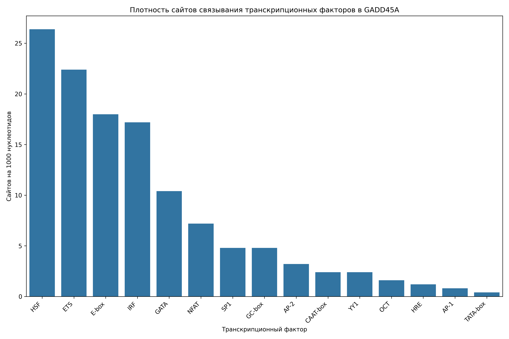

# Анализ сайтов связывания транскрипционных факторов в промоторе гена GADD45A

## Общая информация

* **Длина последовательности**: 2501 нуклеотидов
* **Всего сайтов связывания**: 309
* **Количество различных транскрипционных факторов**: 16

## Распределение транскрипционных факторов

| Транскрипционный фактор | Количество сайтов | Сайтов на 1000 нуклеотидов |
|--------------------------|-------------------|------------------------------|
| HSF | 66 | 26.39 |
| ETS | 56 | 22.39 |
| E-box | 45 | 17.99 |
| IRF | 43 | 17.19 |
| GATA | 26 | 10.40 |
| NFAT | 18 | 7.20 |
| GC-box | 12 | 4.80 |
| SP1 | 12 | 4.80 |
| AP-2 | 8 | 3.20 |
| CAAT-box | 6 | 2.40 |
| YY1 | 6 | 2.40 |
| OCT | 4 | 1.60 |
| HRE | 3 | 1.20 |
| AP-1 | 2 | 0.80 |
| TATA-box | 1 | 0.40 |
| NF-kB | 1 | 0.40 |

## Примеры сайтов связывания

### HSF

| Позиция | Паттерн | Направление |
|---------|---------|-------------|
| 33 | AGAAT | forward |
| 185 | AGAAA | forward |
| 244 | AGAAC | forward |
| 254 | AGAAA | forward |
| 271 | AGAAC | forward |
| 408 | AGAAA | forward |
| 571 | AGAAA | forward |
| 621 | AGAAT | forward |
| 680 | AGAAA | forward |
| 794 | AGAAA | forward |

... и еще 56 сайтов

### ETS

| Позиция | Паттерн | Направление |
|---------|---------|-------------|
| 289 | GGAA | forward |
| 397 | GGAA | forward |
| 834 | GGAA | forward |
| 1059 | GGAA | forward |
| 1084 | GGAA | forward |
| 1089 | GGAA | forward |
| 1304 | GGAA | forward |
| 1325 | GGAA | forward |
| 1588 | GGAA | forward |
| 1941 | GGAA | forward |

... и еще 46 сайтов

### E-box

| Позиция | Паттерн | Направление |
|---------|---------|-------------|
| 192 | CACATG | forward |
| 308 | CAAATG | forward |
| 418 | CAAATG | forward |
| 502 | CAAATG | forward |
| 748 | CATGTG | forward |
| 904 | CATTTG | forward |
| 970 | CATATG | forward |
| 1147 | CAGATG | forward |
| 1162 | CAGCTG | forward |
| 1240 | CACATG | forward |

... и еще 35 сайтов

### IRF

| Позиция | Паттерн | Направление |
|---------|---------|-------------|
| 186 | GAAACT | forward |
| 255 | GAAATG | forward |
| 359 | GAAAAT | forward |
| 409 | GAAAGA | forward |
| 531 | GAAAAA | forward |
| 572 | GAAAAC | forward |
| 681 | GAAATT | forward |
| 795 | GAAATG | forward |
| 960 | GAAATT | forward |
| 1085 | GAAAGG | forward |

... и еще 33 сайтов

### GATA

| Позиция | Паттерн | Направление |
|---------|---------|-------------|
| 639 | TGATAA | forward |
| 1484 | AGATAA | forward |
| 1633 | AGATAA | forward |
| 578 | CTATCA | reverse |
| 947 | TTATCT | reverse |
| 67 | GATA | forward |
| 268 | GATA | forward |
| 441 | GATA | forward |
| 448 | GATA | forward |
| 640 | GATA | forward |

... и еще 16 сайтов

## Визуализации

## Выводы

1. В промоторе гена GADD45A обнаружено 309 потенциальных сайтов связывания транскрипционных факторов.
2. Наиболее представленные факторы: HSF, ETS, E-box.
3. Обнаружены базовые элементы промотора: TATA-box, CAAT-box, GC-box.
4. Наличие TATA-box указывает на классический тип промотора.
5. Паттерн сайтов связывания указывает на возможную воспалительный ответ, реакция на клеточный стресс.
6. Для более детального понимания функциональной значимости обнаруженных сайтов рекомендуется экспериментальная валидация.
