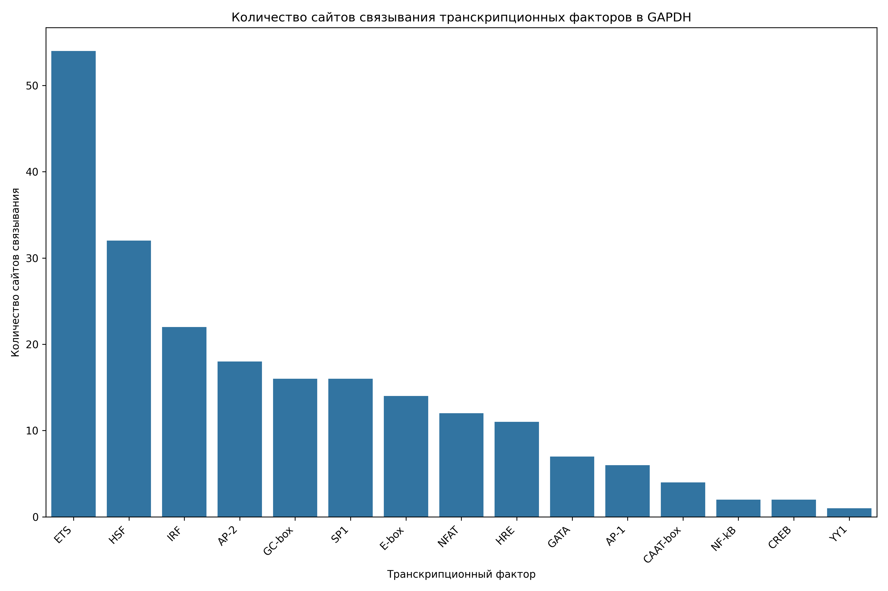
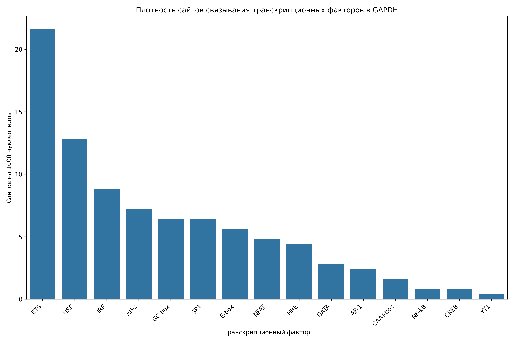

# Анализ сайтов связывания транскрипционных факторов в промоторе гена GAPDH

## Общая информация

* **Длина последовательности**: 2501 нуклеотидов
* **Всего сайтов связывания**: 218
* **Количество различных транскрипционных факторов**: 16

## Распределение транскрипционных факторов

| Транскрипционный фактор | Количество сайтов | Сайтов на 1000 нуклеотидов |
|--------------------------|-------------------|------------------------------|
| ETS | 54 | 21.59 |
| HSF | 32 | 12.79 |
| IRF | 22 | 8.80 |
| AP-2 | 18 | 7.20 |
| GC-box | 16 | 6.40 |
| SP1 | 16 | 6.40 |
| E-box | 14 | 5.60 |
| NFAT | 12 | 4.80 |
| HRE | 11 | 4.40 |
| GATA | 7 | 2.80 |
| AP-1 | 6 | 2.40 |
| CAAT-box | 4 | 1.60 |
| NF-kB | 2 | 0.80 |
| CREB | 2 | 0.80 |
| TATA-box | 1 | 0.40 |
| YY1 | 1 | 0.40 |

## Примеры сайтов связывания

### ETS

| Позиция | Паттерн | Направление |
|---------|---------|-------------|
| 320 | GGAA | forward |
| 402 | GGAA | forward |
| 578 | GGAA | forward |
| 1071 | GGAA | forward |
| 1414 | GGAA | forward |
| 1428 | GGAA | forward |
| 1432 | GGAA | forward |
| 1720 | GGAA | forward |
| 1822 | GGAA | forward |
| 2321 | GGAA | forward |

... и еще 44 сайтов

### HSF

| Позиция | Паттерн | Направление |
|---------|---------|-------------|
| 281 | AGAAG | forward |
| 376 | AGAAA | forward |
| 592 | AGAAA | forward |
| 684 | AGAAG | forward |
| 854 | AGAAG | forward |
| 1286 | AGAAA | forward |
| 1519 | AGAAG | forward |
| 1556 | AGAAA | forward |
| 1840 | AGAAA | forward |
| 2070 | AGAAA | forward |

... и еще 22 сайтов

### IRF

| Позиция | Паттерн | Направление |
|---------|---------|-------------|
| 294 | GAAAAA | forward |
| 377 | GAAAGG | forward |
| 511 | GAAAAG | forward |
| 579 | GAAAGG | forward |
| 593 | GAAAGG | forward |
| 979 | GAAAGG | forward |
| 1076 | GAAAGG | forward |
| 1287 | GAAACC | forward |
| 1553 | GAAAGA | forward |
| 1561 | GAAAGG | forward |

... и еще 12 сайтов

### AP-2

| Позиция | Паттерн | Направление |
|---------|---------|-------------|
| 531 | GCCAGTGGC | forward |
| 1057 | GCCCCAGGC | forward |
| 1176 | GCCTGGGGC | forward |
| 1448 | GCCCGAGGC | forward |
| 2369 | GCCCTGGGC | forward |
| 531 | GCCAGTGGC | reverse |
| 1057 | GCCCCAGGC | reverse |
| 1176 | GCCTGGGGC | reverse |
| 1448 | GCCCGAGGC | reverse |
| 2369 | GCCCTGGGC | reverse |

... и еще 8 сайтов

### GC-box

| Позиция | Паттерн | Направление |
|---------|---------|-------------|
| 1019 | GGGCGG | forward |
| 2062 | GGGCGG | forward |
| 2108 | GGGCGG | forward |
| 2154 | GGGCGG | forward |
| 2174 | GGGCGG | forward |
| 1035 | CCGCCC | reverse |
| 1446 | CCGCCC | reverse |
| 2383 | CCGCCC | reverse |
| 1035 | CCGCCC | forward |
| 1446 | CCGCCC | forward |

... и еще 6 сайтов

## Визуализации

## Выводы

1. В промоторе гена GAPDH обнаружено 218 потенциальных сайтов связывания транскрипционных факторов.
2. Наиболее представленные факторы: ETS, HSF, IRF.
3. Обнаружены базовые элементы промотора: TATA-box, CAAT-box, GC-box.
4. Наличие TATA-box указывает на классический тип промотора.
5. Паттерн сайтов связывания указывает на возможную воспалительный ответ, cAMP-зависимая регуляция, реакция на клеточный стресс.
6. Для более детального понимания функциональной значимости обнаруженных сайтов рекомендуется экспериментальная валидация.
