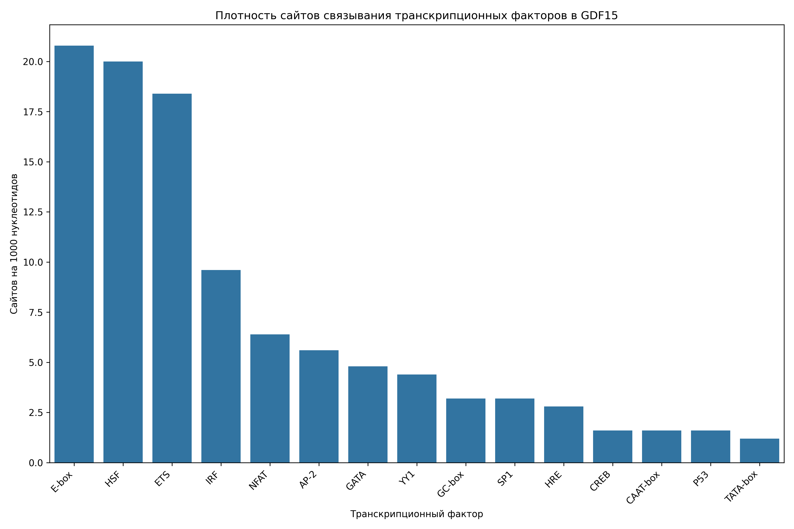

# Анализ сайтов связывания транскрипционных факторов в промоторе гена GDF15

## Общая информация

* **Длина последовательности**: 2501 нуклеотидов
* **Всего сайтов связывания**: 272
* **Количество различных транскрипционных факторов**: 20

## Распределение транскрипционных факторов

| Транскрипционный фактор | Количество сайтов | Сайтов на 1000 нуклеотидов |
|--------------------------|-------------------|------------------------------|
| E-box | 52 | 20.79 |
| HSF | 50 | 19.99 |
| ETS | 46 | 18.39 |
| IRF | 24 | 9.60 |
| NFAT | 16 | 6.40 |
| AP-2 | 14 | 5.60 |
| GATA | 12 | 4.80 |
| YY1 | 11 | 4.40 |
| GC-box | 8 | 3.20 |
| SP1 | 8 | 3.20 |
| HRE | 7 | 2.80 |
| CAAT-box | 4 | 1.60 |
| CREB | 4 | 1.60 |
| P53 | 4 | 1.60 |
| TATA-box | 3 | 1.20 |
| CRE | 2 | 0.80 |
| STAT | 2 | 0.80 |
| ATF/CREB | 2 | 0.80 |
| MYC | 2 | 0.80 |
| NF-kB | 1 | 0.40 |

## Примеры сайтов связывания

### E-box

| Позиция | Паттерн | Направление |
|---------|---------|-------------|
| 303 | CAGCTG | forward |
| 319 | CATGTG | forward |
| 410 | CAGGTG | forward |
| 468 | CACCTG | forward |
| 716 | CAAATG | forward |
| 730 | CAGGTG | forward |
| 1052 | CAGATG | forward |
| 1061 | CACGTG | forward |
| 1455 | CAAGTG | forward |
| 1494 | CATTTG | forward |

... и еще 42 сайтов

### HSF

| Позиция | Паттерн | Направление |
|---------|---------|-------------|
| 186 | AGAAT | forward |
| 575 | AGAAA | forward |
| 663 | AGAAA | forward |
| 815 | AGAAT | forward |
| 1038 | AGAAC | forward |
| 1120 | AGAAT | forward |
| 1255 | AGAAT | forward |
| 1356 | AGAAG | forward |
| 1398 | AGAAT | forward |
| 1664 | AGAAG | forward |

... и еще 40 сайтов

### ETS

| Позиция | Паттерн | Направление |
|---------|---------|-------------|
| 699 | GGAA | forward |
| 759 | GGAA | forward |
| 861 | GGAA | forward |
| 1340 | GGAA | forward |
| 1368 | GGAA | forward |
| 1543 | GGAA | forward |
| 1672 | GGAA | forward |
| 1716 | GGAA | forward |
| 1771 | GGAA | forward |
| 1792 | GGAA | forward |

... и еще 36 сайтов

### IRF

| Позиция | Паттерн | Направление |
|---------|---------|-------------|
| 94 | GAAACC | forward |
| 347 | GAAATT | forward |
| 542 | GAAAGA | forward |
| 576 | GAAACT | forward |
| 664 | GAAATT | forward |
| 700 | GAAATC | forward |
| 875 | GAAAAC | forward |
| 1341 | GAAAGA | forward |
| 1544 | GAAACA | forward |
| 1673 | GAAATC | forward |

... и еще 14 сайтов

### NFAT

| Позиция | Паттерн | Направление |
|---------|---------|-------------|
| 699 | GGAAA | forward |
| 1340 | GGAAA | forward |
| 1543 | GGAAA | forward |
| 1672 | GGAAA | forward |
| 2202 | GGAAA | forward |
| 1532 | TTTCC | reverse |
| 1746 | TTTCC | reverse |
| 2149 | TTTCC | reverse |
| 1532 | TTTCC | forward |
| 1746 | TTTCC | forward |

... и еще 6 сайтов

## Визуализации

## Выводы

1. В промоторе гена GDF15 обнаружено 272 потенциальных сайтов связывания транскрипционных факторов.
2. Наиболее представленные факторы: E-box, HSF, ETS.
3. Обнаружены базовые элементы промотора: TATA-box, CAAT-box, GC-box.
4. Наличие TATA-box указывает на классический тип промотора.
5. Паттерн сайтов связывания указывает на возможную p53-зависимая регуляция, воспалительный ответ, cAMP-зависимая регуляция.
6. Для более детального понимания функциональной значимости обнаруженных сайтов рекомендуется экспериментальная валидация.
