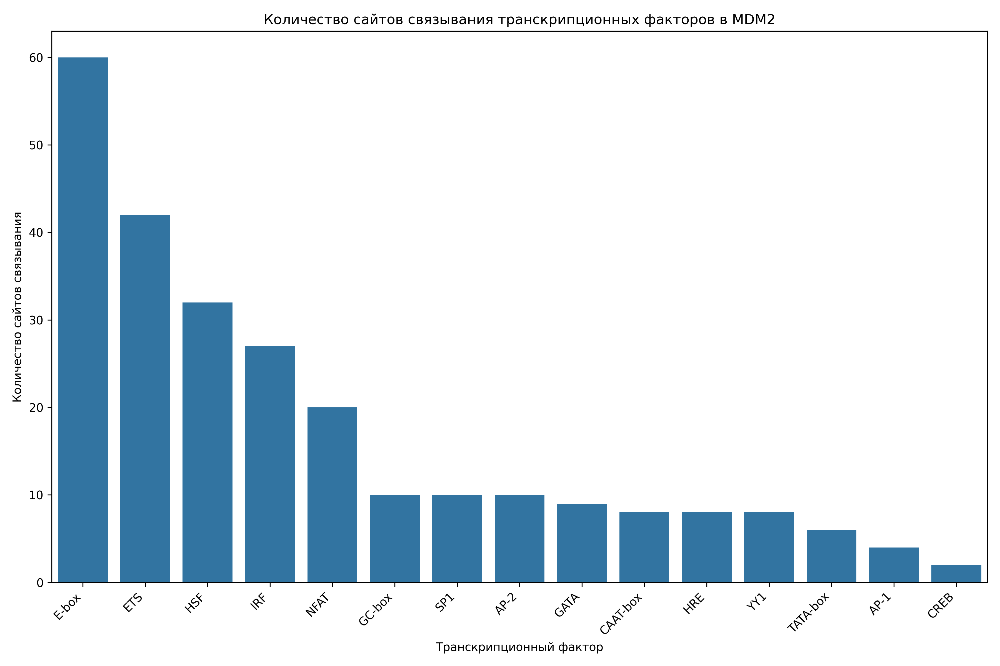

# Анализ сайтов связывания транскрипционных факторов в промоторе гена MDM2

## Общая информация

* **Длина последовательности**: 2501 нуклеотидов
* **Всего сайтов связывания**: 258
* **Количество различных транскрипционных факторов**: 16

## Распределение транскрипционных факторов

| Транскрипционный фактор | Количество сайтов | Сайтов на 1000 нуклеотидов |
|--------------------------|-------------------|------------------------------|
| E-box | 60 | 23.99 |
| ETS | 42 | 16.79 |
| HSF | 32 | 12.79 |
| IRF | 27 | 10.80 |
| NFAT | 20 | 8.00 |
| GC-box | 10 | 4.00 |
| SP1 | 10 | 4.00 |
| AP-2 | 10 | 4.00 |
| GATA | 9 | 3.60 |
| CAAT-box | 8 | 3.20 |
| HRE | 8 | 3.20 |
| YY1 | 8 | 3.20 |
| TATA-box | 6 | 2.40 |
| AP-1 | 4 | 1.60 |
| CREB | 2 | 0.80 |
| MYC | 2 | 0.80 |

## Примеры сайтов связывания

### E-box

| Позиция | Паттерн | Направление |
|---------|---------|-------------|
| 419 | CAGGTG | forward |
| 512 | CAAGTG | forward |
| 661 | CAGCTG | forward |
| 738 | CATTTG | forward |
| 787 | CAGCTG | forward |
| 835 | CATTTG | forward |
| 1066 | CAATTG | forward |
| 1103 | CAAATG | forward |
| 1612 | CACGTG | forward |
| 1802 | CAGGTG | forward |

... и еще 50 сайтов

### ETS

| Позиция | Паттерн | Направление |
|---------|---------|-------------|
| 18 | GGAA | forward |
| 195 | GGAA | forward |
| 862 | GGAA | forward |
| 1074 | GGAA | forward |
| 1218 | GGAA | forward |
| 1355 | GGAA | forward |
| 1404 | GGAA | forward |
| 2254 | GGAA | forward |
| 93 | TTCC | reverse |
| 474 | TTCC | reverse |

... и еще 32 сайтов

### HSF

| Позиция | Паттерн | Направление |
|---------|---------|-------------|
| 13 | AGAAG | forward |
| 81 | AGAAG | forward |
| 211 | AGAAT | forward |
| 657 | AGAAC | forward |
| 877 | AGAAA | forward |
| 1232 | AGAAG | forward |
| 2299 | AGAAT | forward |
| 2435 | AGAAC | forward |
| 96 | CTTCT | reverse |
| 136 | ATTCT | reverse |

... и еще 22 сайтов

### IRF

| Позиция | Паттерн | Направление |
|---------|---------|-------------|
| 85 | GAAACG | forward |
| 196 | GAAAGT | forward |
| 878 | GAAATA | forward |
| 1219 | GAAAGA | forward |
| 1405 | GAAACT | forward |
| 1444 | GAAAAC | forward |
| 1921 | GAAACT | forward |
| 471 | CGTTTC | reverse |
| 801 | GGTTTC | reverse |
| 845 | AGTTTC | reverse |

... и еще 17 сайтов

### NFAT

| Позиция | Паттерн | Направление |
|---------|---------|-------------|
| 195 | GGAAA | forward |
| 1218 | GGAAA | forward |
| 1404 | GGAAA | forward |
| 473 | TTTCC | reverse |
| 847 | TTTCC | reverse |
| 1886 | TTTCC | reverse |
| 1985 | TTTCC | reverse |
| 2129 | TTTCC | reverse |
| 2149 | TTTCC | reverse |
| 2174 | TTTCC | reverse |

... и еще 10 сайтов

## Визуализации

## Выводы

1. В промоторе гена MDM2 обнаружено 258 потенциальных сайтов связывания транскрипционных факторов.
2. Наиболее представленные факторы: E-box, ETS, HSF.
3. Обнаружены базовые элементы промотора: TATA-box, CAAT-box, GC-box.
4. Наличие TATA-box указывает на классический тип промотора.
5. Паттерн сайтов связывания указывает на возможную cAMP-зависимая регуляция, реакция на клеточный стресс.
6. Для более детального понимания функциональной значимости обнаруженных сайтов рекомендуется экспериментальная валидация.
