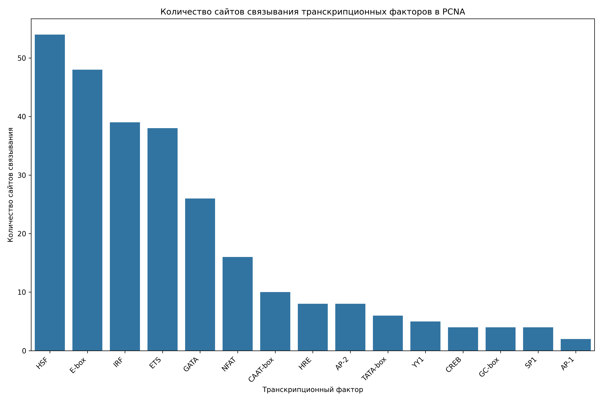

# Анализ сайтов связывания транскрипционных факторов в промоторе гена PCNA

## Общая информация

* **Длина последовательности**: 2501 нуклеотидов
* **Всего сайтов связывания**: 278
* **Количество различных транскрипционных факторов**: 18

## Распределение транскрипционных факторов

| Транскрипционный фактор | Количество сайтов | Сайтов на 1000 нуклеотидов |
|--------------------------|-------------------|------------------------------|
| HSF | 54 | 21.59 |
| E-box | 48 | 19.19 |
| IRF | 39 | 15.59 |
| ETS | 38 | 15.19 |
| GATA | 26 | 10.40 |
| NFAT | 16 | 6.40 |
| CAAT-box | 10 | 4.00 |
| HRE | 8 | 3.20 |
| AP-2 | 8 | 3.20 |
| TATA-box | 6 | 2.40 |
| YY1 | 5 | 2.00 |
| GC-box | 4 | 1.60 |
| SP1 | 4 | 1.60 |
| CREB | 4 | 1.60 |
| AP-1 | 2 | 0.80 |
| NF-kB | 2 | 0.80 |
| OCT | 2 | 0.80 |
| P53 | 2 | 0.80 |

## Примеры сайтов связывания

### HSF

| Позиция | Паттерн | Направление |
|---------|---------|-------------|
| 235 | AGAAG | forward |
| 312 | AGAAA | forward |
| 401 | AGAAA | forward |
| 459 | AGAAG | forward |
| 516 | AGAAC | forward |
| 574 | AGAAA | forward |
| 595 | AGAAT | forward |
| 638 | AGAAT | forward |
| 717 | AGAAA | forward |
| 728 | AGAAT | forward |

... и еще 44 сайтов

### E-box

| Позиция | Паттерн | Направление |
|---------|---------|-------------|
| 380 | CAATTG | forward |
| 535 | CAGCTG | forward |
| 819 | CAATTG | forward |
| 886 | CAGGTG | forward |
| 905 | CAGGTG | forward |
| 1004 | CACCTG | forward |
| 1046 | CACTTG | forward |
| 1184 | CAGCTG | forward |
| 1283 | CATGTG | forward |
| 1369 | CAAGTG | forward |

... и еще 38 сайтов

### IRF

| Позиция | Паттерн | Направление |
|---------|---------|-------------|
| 313 | GAAAAT | forward |
| 402 | GAAATG | forward |
| 504 | GAAACT | forward |
| 547 | GAAAAA | forward |
| 571 | GAAAGA | forward |
| 654 | GAAATG | forward |
| 718 | GAAAAA | forward |
| 779 | GAAAGC | forward |
| 791 | GAAACA | forward |
| 824 | GAAAAT | forward |

... и еще 29 сайтов

### ETS

| Позиция | Паттерн | Направление |
|---------|---------|-------------|
| 84 | GGAA | forward |
| 492 | GGAA | forward |
| 546 | GGAA | forward |
| 570 | GGAA | forward |
| 1141 | GGAA | forward |
| 1380 | GGAA | forward |
| 1483 | GGAA | forward |
| 1678 | GGAA | forward |
| 2397 | GGAA | forward |
| 412 | TTCC | reverse |

... и еще 28 сайтов

### GATA

| Позиция | Паттерн | Направление |
|---------|---------|-------------|
| 6 | TGATAA | forward |
| 589 | AGATAA | forward |
| 1264 | TGATAA | forward |
| 1316 | TGATAA | forward |
| 1498 | TGATAG | forward |
| 1535 | TTATCT | reverse |
| 7 | GATA | forward |
| 454 | GATA | forward |
| 590 | GATA | forward |
| 615 | GATA | forward |

... и еще 16 сайтов

## Визуализации

## Выводы

1. В промоторе гена PCNA обнаружено 278 потенциальных сайтов связывания транскрипционных факторов.
2. Наиболее представленные факторы: HSF, E-box, IRF.
3. Обнаружены базовые элементы промотора: TATA-box, CAAT-box, GC-box.
4. Наличие TATA-box указывает на классический тип промотора.
5. Паттерн сайтов связывания указывает на возможную p53-зависимая регуляция, воспалительный ответ, cAMP-зависимая регуляция, реакция на клеточный стресс.
6. Для более детального понимания функциональной значимости обнаруженных сайтов рекомендуется экспериментальная валидация.
