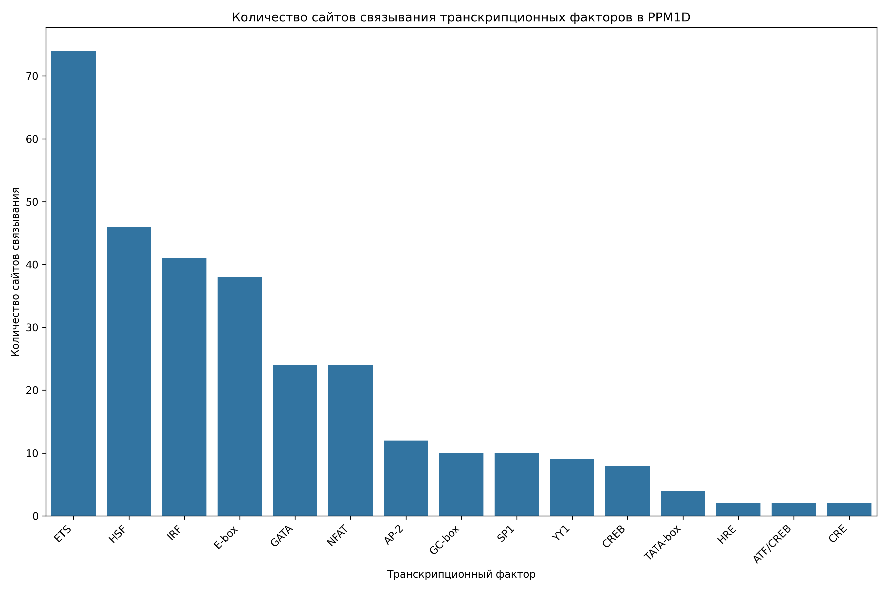

# Анализ сайтов связывания транскрипционных факторов в промоторе гена PPM1D

## Общая информация

* **Длина последовательности**: 2501 нуклеотидов
* **Всего сайтов связывания**: 310
* **Количество различных транскрипционных факторов**: 17

## Распределение транскрипционных факторов

| Транскрипционный фактор | Количество сайтов | Сайтов на 1000 нуклеотидов |
|--------------------------|-------------------|------------------------------|
| ETS | 74 | 29.59 |
| HSF | 46 | 18.39 |
| IRF | 41 | 16.39 |
| E-box | 38 | 15.19 |
| GATA | 24 | 9.60 |
| NFAT | 24 | 9.60 |
| AP-2 | 12 | 4.80 |
| GC-box | 10 | 4.00 |
| SP1 | 10 | 4.00 |
| YY1 | 9 | 3.60 |
| CREB | 8 | 3.20 |
| TATA-box | 4 | 1.60 |
| CAAT-box | 2 | 0.80 |
| CRE | 2 | 0.80 |
| HRE | 2 | 0.80 |
| ATF/CREB | 2 | 0.80 |
| P53 | 2 | 0.80 |

## Примеры сайтов связывания

### ETS

| Позиция | Паттерн | Направление |
|---------|---------|-------------|
| 22 | GGAA | forward |
| 144 | GGAA | forward |
| 148 | GGAA | forward |
| 177 | GGAA | forward |
| 209 | GGAA | forward |
| 282 | GGAA | forward |
| 288 | GGAA | forward |
| 299 | GGAA | forward |
| 331 | GGAA | forward |
| 408 | GGAA | forward |

... и еще 64 сайтов

### HSF

| Позиция | Паттерн | Направление |
|---------|---------|-------------|
| 4 | AGAAG | forward |
| 25 | AGAAA | forward |
| 153 | AGAAG | forward |
| 194 | AGAAT | forward |
| 310 | AGAAG | forward |
| 321 | AGAAT | forward |
| 1035 | AGAAA | forward |
| 1364 | AGAAT | forward |
| 1459 | AGAAC | forward |
| 1700 | AGAAC | forward |

... и еще 36 сайтов

### IRF

| Позиция | Паттерн | Направление |
|---------|---------|-------------|
| 26 | GAAACA | forward |
| 47 | GAAAAA | forward |
| 210 | GAAAAA | forward |
| 231 | GAAAAG | forward |
| 354 | GAAATC | forward |
| 373 | GAAATG | forward |
| 496 | GAAAGG | forward |
| 995 | GAAAAT | forward |
| 1017 | GAAAGT | forward |
| 1036 | GAAATG | forward |

... и еще 31 сайтов

### E-box

| Позиция | Паттерн | Направление |
|---------|---------|-------------|
| 125 | CACTTG | forward |
| 277 | CAGTTG | forward |
| 346 | CAGATG | forward |
| 786 | CATCTG | forward |
| 823 | CAATTG | forward |
| 941 | CAACTG | forward |
| 990 | CATTTG | forward |
| 1255 | CAAGTG | forward |
| 1419 | CAGCTG | forward |
| 1529 | CACTTG | forward |

... и еще 28 сайтов

### GATA

| Позиция | Паттерн | Направление |
|---------|---------|-------------|
| 189 | AGATAA | forward |
| 262 | TGATAA | forward |
| 1259 | TGATAA | forward |
| 2128 | AGATAA | forward |
| 521 | TTATCT | reverse |
| 62 | GATA | forward |
| 190 | GATA | forward |
| 263 | GATA | forward |
| 384 | GATA | forward |
| 403 | GATA | forward |

... и еще 14 сайтов

## Визуализации

## Выводы

1. В промоторе гена PPM1D обнаружено 310 потенциальных сайтов связывания транскрипционных факторов.
2. Наиболее представленные факторы: ETS, HSF, IRF.
3. Обнаружены базовые элементы промотора: TATA-box, CAAT-box, GC-box.
4. Наличие TATA-box указывает на классический тип промотора.
5. Паттерн сайтов связывания указывает на возможную p53-зависимая регуляция, cAMP-зависимая регуляция.
6. Для более детального понимания функциональной значимости обнаруженных сайтов рекомендуется экспериментальная валидация.
