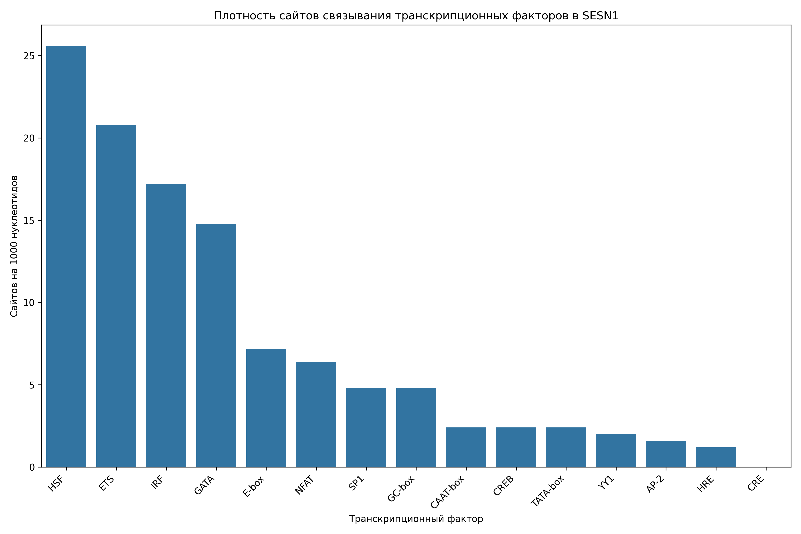

# Анализ сайтов связывания транскрипционных факторов в промоторе гена SESN1

## Общая информация

* **Длина последовательности**: 2501 нуклеотидов
* **Всего сайтов связывания**: 284
* **Количество различных транскрипционных факторов**: 14

## Распределение транскрипционных факторов

| Транскрипционный фактор | Количество сайтов | Сайтов на 1000 нуклеотидов |
|--------------------------|-------------------|------------------------------|
| HSF | 64 | 25.59 |
| ETS | 52 | 20.79 |
| IRF | 43 | 17.19 |
| GATA | 37 | 14.79 |
| E-box | 18 | 7.20 |
| NFAT | 16 | 6.40 |
| GC-box | 12 | 4.80 |
| SP1 | 12 | 4.80 |
| TATA-box | 6 | 2.40 |
| CAAT-box | 6 | 2.40 |
| CREB | 6 | 2.40 |
| YY1 | 5 | 2.00 |
| AP-2 | 4 | 1.60 |
| HRE | 3 | 1.20 |

## Примеры сайтов связывания

### HSF

| Позиция | Паттерн | Направление |
|---------|---------|-------------|
| 38 | AGAAC | forward |
| 44 | AGAAA | forward |
| 145 | AGAAT | forward |
| 405 | AGAAA | forward |
| 492 | AGAAA | forward |
| 520 | AGAAC | forward |
| 874 | AGAAC | forward |
| 1087 | AGAAT | forward |
| 1195 | AGAAT | forward |
| 1212 | AGAAA | forward |

... и еще 54 сайтов

### ETS

| Позиция | Паттерн | Направление |
|---------|---------|-------------|
| 63 | GGAA | forward |
| 96 | GGAA | forward |
| 216 | GGAA | forward |
| 223 | GGAA | forward |
| 412 | GGAA | forward |
| 766 | GGAA | forward |
| 1171 | GGAA | forward |
| 1366 | GGAA | forward |
| 1406 | GGAA | forward |
| 1564 | GGAA | forward |

... и еще 42 сайтов

### IRF

| Позиция | Паттерн | Направление |
|---------|---------|-------------|
| 45 | GAAATT | forward |
| 203 | GAAACT | forward |
| 217 | GAAAAA | forward |
| 264 | GAAATA | forward |
| 406 | GAAAAT | forward |
| 413 | GAAAGA | forward |
| 493 | GAAATA | forward |
| 1014 | GAAACT | forward |
| 1134 | GAAAAC | forward |
| 1213 | GAAATA | forward |

... и еще 33 сайтов

### GATA

| Позиция | Паттерн | Направление |
|---------|---------|-------------|
| 416 | AGATAA | forward |
| 905 | AGATAA | forward |
| 947 | TGATAG | forward |
| 1424 | AGATAG | forward |
| 2328 | AGATAG | forward |
| 207 | CTATCT | reverse |
| 286 | TTATCA | reverse |
| 629 | TTATCT | reverse |
| 888 | TTATCT | reverse |
| 1444 | TTATCT | reverse |

... и еще 27 сайтов

### E-box

| Позиция | Паттерн | Направление |
|---------|---------|-------------|
| 336 | CACTTG | forward |
| 437 | CAAATG | forward |
| 588 | CAAGTG | forward |
| 715 | CATTTG | forward |
| 1071 | CACTTG | forward |
| 1266 | CAGTTG | forward |
| 336 | CACTTG | reverse |
| 437 | CAAATG | reverse |
| 588 | CAAGTG | reverse |
| 715 | CATTTG | reverse |

... и еще 8 сайтов

## Визуализации

## Выводы

1. В промоторе гена SESN1 обнаружено 284 потенциальных сайтов связывания транскрипционных факторов.
2. Наиболее представленные факторы: HSF, ETS, IRF.
3. Обнаружены базовые элементы промотора: TATA-box, CAAT-box, GC-box.
4. Наличие TATA-box указывает на классический тип промотора.
5. Паттерн сайтов связывания указывает на возможную cAMP-зависимая регуляция.
6. Для более детального понимания функциональной значимости обнаруженных сайтов рекомендуется экспериментальная валидация.
