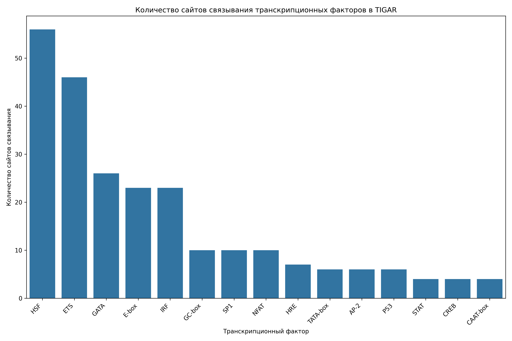

# Анализ сайтов связывания транскрипционных факторов в промоторе гена TIGAR

## Общая информация

* **Длина последовательности**: 2501 нуклеотидов
* **Всего сайтов связывания**: 250
* **Количество различных транскрипционных факторов**: 19

## Распределение транскрипционных факторов

| Транскрипционный фактор | Количество сайтов | Сайтов на 1000 нуклеотидов |
|--------------------------|-------------------|------------------------------|
| HSF | 56 | 22.39 |
| ETS | 46 | 18.39 |
| GATA | 26 | 10.40 |
| E-box | 23 | 9.20 |
| IRF | 23 | 9.20 |
| GC-box | 10 | 4.00 |
| SP1 | 10 | 4.00 |
| NFAT | 10 | 4.00 |
| HRE | 7 | 2.80 |
| TATA-box | 6 | 2.40 |
| AP-2 | 6 | 2.40 |
| P53 | 6 | 2.40 |
| CAAT-box | 4 | 1.60 |
| STAT | 4 | 1.60 |
| CREB | 4 | 1.60 |
| YY1 | 3 | 1.20 |
| AP-1 | 2 | 0.80 |
| NF-kB | 2 | 0.80 |
| MYC | 2 | 0.80 |

## Примеры сайтов связывания

### HSF

| Позиция | Паттерн | Направление |
|---------|---------|-------------|
| 5 | AGAAT | forward |
| 15 | AGAAG | forward |
| 156 | AGAAT | forward |
| 271 | AGAAG | forward |
| 309 | AGAAA | forward |
| 370 | AGAAG | forward |
| 884 | AGAAT | forward |
| 1002 | AGAAG | forward |
| 1047 | AGAAT | forward |
| 1082 | AGAAA | forward |

... и еще 46 сайтов

### ETS

| Позиция | Паттерн | Направление |
|---------|---------|-------------|
| 131 | GGAA | forward |
| 177 | GGAA | forward |
| 427 | GGAA | forward |
| 547 | GGAA | forward |
| 601 | GGAA | forward |
| 629 | GGAA | forward |
| 657 | GGAA | forward |
| 1019 | GGAA | forward |
| 1276 | GGAA | forward |
| 1298 | GGAA | forward |

... и еще 36 сайтов

### GATA

| Позиция | Паттерн | Направление |
|---------|---------|-------------|
| 1399 | TGATAA | forward |
| 2308 | AGATAG | forward |
| 2330 | AGATAA | forward |
| 1321 | CTATCT | reverse |
| 1723 | TTATCT | reverse |
| 29 | GATA | forward |
| 1354 | GATA | forward |
| 1400 | GATA | forward |
| 2309 | GATA | forward |
| 2331 | GATA | forward |

... и еще 16 сайтов

### E-box

| Позиция | Паттерн | Направление |
|---------|---------|-------------|
| 22 | CAAATG | forward |
| 387 | CAGATG | forward |
| 410 | CACTTG | forward |
| 450 | CACGTG | forward |
| 1154 | CATCTG | forward |
| 1799 | CACCTG | forward |
| 2374 | CACTTG | forward |
| 22 | CAAATG | reverse |
| 387 | CAGATG | reverse |
| 410 | CACTTG | reverse |

... и еще 13 сайтов

### IRF

| Позиция | Паттерн | Направление |
|---------|---------|-------------|
| 52 | GAAATG | forward |
| 132 | GAAATA | forward |
| 148 | GAAATA | forward |
| 310 | GAAATA | forward |
| 548 | GAAAAA | forward |
| 685 | GAAAAA | forward |
| 798 | GAAACC | forward |
| 1078 | GAAAAG | forward |
| 1145 | GAAATT | forward |
| 1285 | GAAAGA | forward |

... и еще 13 сайтов

## Визуализации

## Выводы

1. В промоторе гена TIGAR обнаружено 250 потенциальных сайтов связывания транскрипционных факторов.
2. Наиболее представленные факторы: HSF, ETS, GATA.
3. Обнаружены базовые элементы промотора: TATA-box, CAAT-box, GC-box.
4. Наличие TATA-box указывает на классический тип промотора.
5. Паттерн сайтов связывания указывает на возможную p53-зависимая регуляция, воспалительный ответ, cAMP-зависимая регуляция, реакция на клеточный стресс.
6. Для более детального понимания функциональной значимости обнаруженных сайтов рекомендуется экспериментальная валидация.
