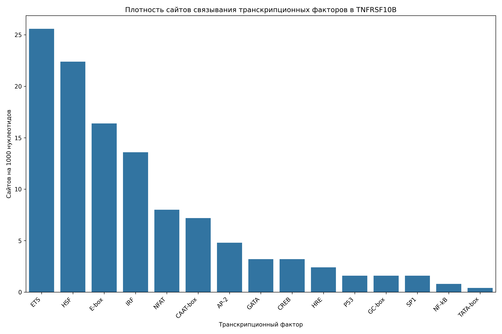

# Анализ сайтов связывания транскрипционных факторов в промоторе гена TNFRSF10B

## Общая информация

* **Длина последовательности**: 2501 нуклеотидов
* **Всего сайтов связывания**: 282
* **Количество различных транскрипционных факторов**: 15

## Распределение транскрипционных факторов

| Транскрипционный фактор | Количество сайтов | Сайтов на 1000 нуклеотидов |
|--------------------------|-------------------|------------------------------|
| ETS | 64 | 25.59 |
| HSF | 56 | 22.39 |
| E-box | 41 | 16.39 |
| IRF | 34 | 13.59 |
| NFAT | 20 | 8.00 |
| CAAT-box | 18 | 7.20 |
| AP-2 | 12 | 4.80 |
| GATA | 8 | 3.20 |
| CREB | 8 | 3.20 |
| HRE | 6 | 2.40 |
| GC-box | 4 | 1.60 |
| SP1 | 4 | 1.60 |
| P53 | 4 | 1.60 |
| NF-kB | 2 | 0.80 |
| TATA-box | 1 | 0.40 |

## Примеры сайтов связывания

### ETS

| Позиция | Паттерн | Направление |
|---------|---------|-------------|
| 556 | GGAA | forward |
| 712 | GGAA | forward |
| 853 | GGAA | forward |
| 902 | GGAA | forward |
| 954 | GGAA | forward |
| 987 | GGAA | forward |
| 1106 | GGAA | forward |
| 1372 | GGAA | forward |
| 1452 | GGAA | forward |
| 1484 | GGAA | forward |

... и еще 54 сайтов

### HSF

| Позиция | Паттерн | Направление |
|---------|---------|-------------|
| 354 | AGAAC | forward |
| 514 | AGAAC | forward |
| 564 | AGAAC | forward |
| 670 | AGAAT | forward |
| 857 | AGAAC | forward |
| 950 | AGAAG | forward |
| 957 | AGAAA | forward |
| 983 | AGAAG | forward |
| 1015 | AGAAC | forward |
| 1073 | AGAAC | forward |

... и еще 46 сайтов

### E-box

| Позиция | Паттерн | Направление |
|---------|---------|-------------|
| 285 | CACCTG | forward |
| 322 | CACCTG | forward |
| 391 | CAATTG | forward |
| 473 | CAATTG | forward |
| 568 | CATTTG | forward |
| 1161 | CAAATG | forward |
| 1203 | CATTTG | forward |
| 1601 | CAGGTG | forward |
| 1710 | CAAGTG | forward |
| 1844 | CACTTG | forward |

... и еще 31 сайтов

### IRF

| Позиция | Паттерн | Направление |
|---------|---------|-------------|
| 854 | GAAAGA | forward |
| 958 | GAAACT | forward |
| 1111 | GAAAAT | forward |
| 1166 | GAAAGC | forward |
| 1485 | GAAAGA | forward |
| 1491 | GAAAGA | forward |
| 1499 | GAAAGG | forward |
| 1508 | GAAAGA | forward |
| 1514 | GAAAGC | forward |
| 1530 | GAAAGA | forward |

... и еще 24 сайтов

### NFAT

| Позиция | Паттерн | Направление |
|---------|---------|-------------|
| 853 | GGAAA | forward |
| 1484 | GGAAA | forward |
| 1507 | GGAAA | forward |
| 1529 | GGAAA | forward |
| 1569 | GGAAA | forward |
| 1640 | GGAAA | forward |
| 2181 | GGAAA | forward |
| 725 | TTTCC | reverse |
| 1145 | TTTCC | reverse |
| 1730 | TTTCC | reverse |

... и еще 10 сайтов

## Визуализации

## Выводы

1. В промоторе гена TNFRSF10B обнаружено 282 потенциальных сайтов связывания транскрипционных факторов.
2. Наиболее представленные факторы: ETS, HSF, E-box.
3. Обнаружены базовые элементы промотора: TATA-box, CAAT-box, GC-box.
4. Наличие TATA-box указывает на классический тип промотора.
5. Паттерн сайтов связывания указывает на возможную p53-зависимая регуляция, воспалительный ответ, cAMP-зависимая регуляция.
6. Для более детального понимания функциональной значимости обнаруженных сайтов рекомендуется экспериментальная валидация.
