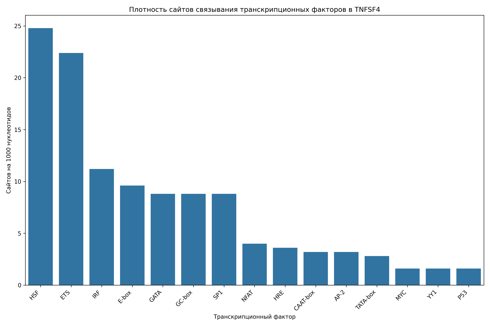

# Анализ сайтов связывания транскрипционных факторов в промоторе гена TNFSF4

## Общая информация

* **Длина последовательности**: 2501 нуклеотидов
* **Всего сайтов связывания**: 294
* **Количество различных транскрипционных факторов**: 16

## Распределение транскрипционных факторов

| Транскрипционный фактор | Количество сайтов | Сайтов на 1000 нуклеотидов |
|--------------------------|-------------------|------------------------------|
| HSF | 62 | 24.79 |
| ETS | 56 | 22.39 |
| IRF | 28 | 11.20 |
| E-box | 24 | 9.60 |
| GC-box | 22 | 8.80 |
| SP1 | 22 | 8.80 |
| GATA | 22 | 8.80 |
| NFAT | 10 | 4.00 |
| HRE | 9 | 3.60 |
| CAAT-box | 8 | 3.20 |
| AP-2 | 8 | 3.20 |
| TATA-box | 7 | 2.80 |
| CREB | 4 | 1.60 |
| YY1 | 4 | 1.60 |
| P53 | 4 | 1.60 |
| MYC | 4 | 1.60 |

## Примеры сайтов связывания

### HSF

| Позиция | Паттерн | Направление |
|---------|---------|-------------|
| 20 | AGAAA | forward |
| 50 | AGAAT | forward |
| 227 | AGAAT | forward |
| 329 | AGAAC | forward |
| 383 | AGAAC | forward |
| 573 | AGAAG | forward |
| 584 | AGAAA | forward |
| 686 | AGAAT | forward |
| 715 | AGAAA | forward |
| 901 | AGAAG | forward |

... и еще 52 сайтов

### ETS

| Позиция | Паттерн | Направление |
|---------|---------|-------------|
| 176 | GGAA | forward |
| 326 | GGAA | forward |
| 410 | GGAA | forward |
| 618 | GGAA | forward |
| 667 | GGAA | forward |
| 704 | GGAA | forward |
| 748 | GGAA | forward |
| 1067 | GGAA | forward |
| 1364 | GGAA | forward |
| 1378 | GGAA | forward |

... и еще 46 сайтов

### IRF

| Позиция | Паттерн | Направление |
|---------|---------|-------------|
| 21 | GAAATA | forward |
| 177 | GAAAAG | forward |
| 424 | GAAAAC | forward |
| 585 | GAAAGC | forward |
| 619 | GAAAAC | forward |
| 716 | GAAAGT | forward |
| 1431 | GAAACA | forward |
| 1510 | GAAAGT | forward |
| 1520 | GAAACG | forward |
| 2448 | GAAATC | forward |

... и еще 18 сайтов

### E-box

| Позиция | Паттерн | Направление |
|---------|---------|-------------|
| 214 | CATATG | forward |
| 565 | CATGTG | forward |
| 650 | CACGTG | forward |
| 731 | CAAGTG | forward |
| 928 | CAGATG | forward |
| 965 | CAGCTG | forward |
| 1930 | CACGTG | forward |
| 214 | CATATG | reverse |
| 565 | CATGTG | reverse |
| 650 | CACGTG | reverse |

... и еще 14 сайтов

### GC-box

| Позиция | Паттерн | Направление |
|---------|---------|-------------|
| 1038 | GGGCGG | forward |
| 1168 | GGGCGG | forward |
| 1387 | GGGCGG | forward |
| 1698 | GGGCGG | forward |
| 1710 | GGGCGG | forward |
| 1719 | GGGCGG | forward |
| 1779 | GGGCGG | forward |
| 1801 | GGGCGG | forward |
| 1084 | CCGCCC | reverse |
| 2100 | CCGCCC | reverse |

... и еще 12 сайтов

## Визуализации

## Выводы

1. В промоторе гена TNFSF4 обнаружено 294 потенциальных сайтов связывания транскрипционных факторов.
2. Наиболее представленные факторы: HSF, ETS, IRF.
3. Обнаружены базовые элементы промотора: TATA-box, CAAT-box, GC-box.
4. Наличие TATA-box указывает на классический тип промотора.
5. Паттерн сайтов связывания указывает на возможную p53-зависимая регуляция, cAMP-зависимая регуляция.
6. Для более детального понимания функциональной значимости обнаруженных сайтов рекомендуется экспериментальная валидация.
