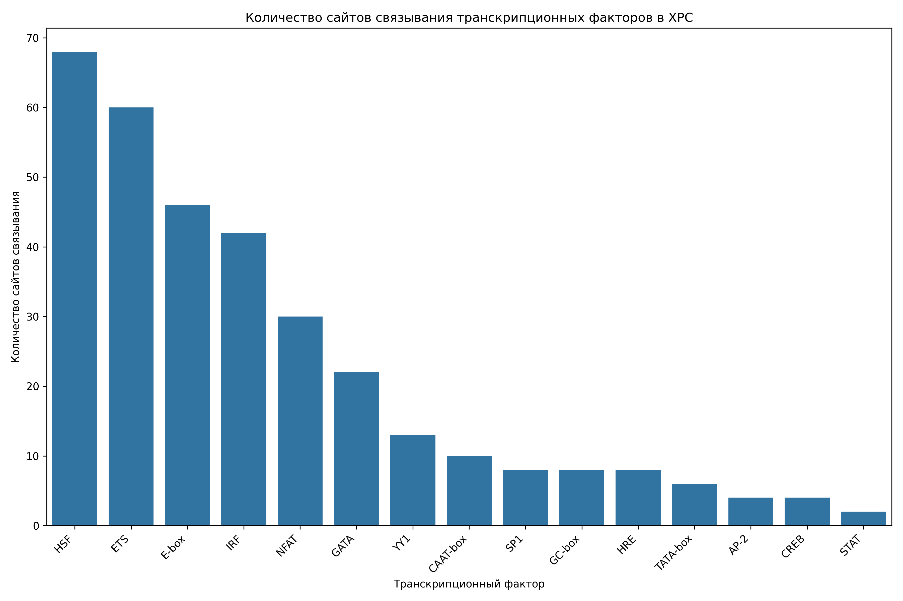
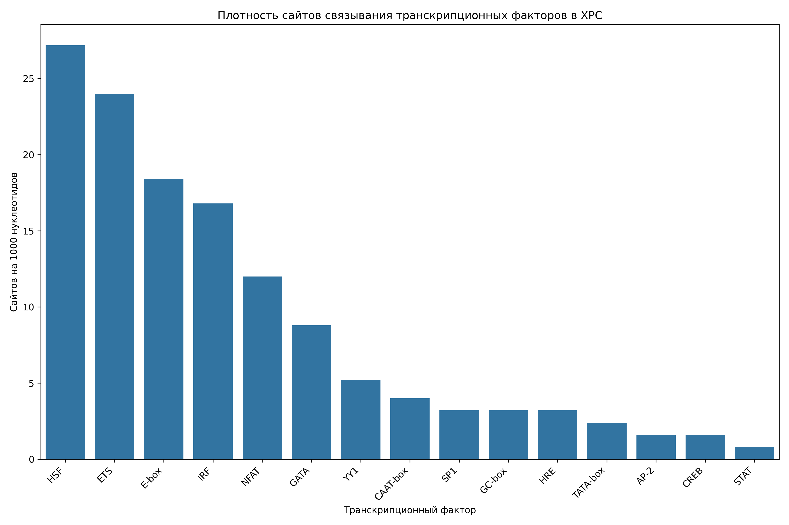

# Анализ сайтов связывания транскрипционных факторов в промоторе гена XPC

## Общая информация

* **Длина последовательности**: 2501 нуклеотидов
* **Всего сайтов связывания**: 331
* **Количество различных транскрипционных факторов**: 15

## Распределение транскрипционных факторов

| Транскрипционный фактор | Количество сайтов | Сайтов на 1000 нуклеотидов |
|--------------------------|-------------------|------------------------------|
| HSF | 68 | 27.19 |
| ETS | 60 | 23.99 |
| E-box | 46 | 18.39 |
| IRF | 42 | 16.79 |
| NFAT | 30 | 12.00 |
| GATA | 22 | 8.80 |
| YY1 | 13 | 5.20 |
| CAAT-box | 10 | 4.00 |
| GC-box | 8 | 3.20 |
| SP1 | 8 | 3.20 |
| HRE | 8 | 3.20 |
| TATA-box | 6 | 2.40 |
| CREB | 4 | 1.60 |
| AP-2 | 4 | 1.60 |
| STAT | 2 | 0.80 |

## Примеры сайтов связывания

### HSF

| Позиция | Паттерн | Направление |
|---------|---------|-------------|
| 63 | AGAAA | forward |
| 205 | AGAAT | forward |
| 302 | AGAAA | forward |
| 307 | AGAAT | forward |
| 312 | AGAAA | forward |
| 328 | AGAAA | forward |
| 360 | AGAAC | forward |
| 450 | AGAAA | forward |
| 553 | AGAAA | forward |
| 650 | AGAAG | forward |

... и еще 58 сайтов

### ETS

| Позиция | Паттерн | Направление |
|---------|---------|-------------|
| 323 | GGAA | forward |
| 369 | GGAA | forward |
| 421 | GGAA | forward |
| 501 | GGAA | forward |
| 1134 | GGAA | forward |
| 1225 | GGAA | forward |
| 1445 | GGAA | forward |
| 1546 | GGAA | forward |
| 1591 | GGAA | forward |
| 1663 | GGAA | forward |

... и еще 50 сайтов

### E-box

| Позиция | Паттерн | Направление |
|---------|---------|-------------|
| 75 | CACCTG | forward |
| 152 | CAGGTG | forward |
| 168 | CACCTG | forward |
| 210 | CACTTG | forward |
| 416 | CACATG | forward |
| 572 | CAACTG | forward |
| 600 | CAAGTG | forward |
| 627 | CAACTG | forward |
| 730 | CACATG | forward |
| 1147 | CAGGTG | forward |

... и еще 36 сайтов

### IRF

| Позиция | Паттерн | Направление |
|---------|---------|-------------|
| 64 | GAAAGG | forward |
| 117 | GAAACC | forward |
| 133 | GAAAAA | forward |
| 303 | GAAAAG | forward |
| 313 | GAAAAA | forward |
| 324 | GAAAAG | forward |
| 370 | GAAACA | forward |
| 451 | GAAAGA | forward |
| 554 | GAAAAA | forward |
| 735 | GAAAAA | forward |

... и еще 32 сайтов

### NFAT

| Позиция | Паттерн | Направление |
|---------|---------|-------------|
| 323 | GGAAA | forward |
| 369 | GGAAA | forward |
| 1546 | GGAAA | forward |
| 1591 | GGAAA | forward |
| 1663 | GGAAA | forward |
| 1802 | GGAAA | forward |
| 1826 | GGAAA | forward |
| 2041 | GGAAA | forward |
| 873 | TTTCC | reverse |
| 1198 | TTTCC | reverse |

... и еще 20 сайтов

## Визуализации

## Выводы

1. В промоторе гена XPC обнаружено 331 потенциальных сайтов связывания транскрипционных факторов.
2. Наиболее представленные факторы: HSF, ETS, E-box.
3. Обнаружены базовые элементы промотора: TATA-box, CAAT-box, GC-box.
4. Наличие TATA-box указывает на классический тип промотора.
5. Паттерн сайтов связывания указывает на возможную cAMP-зависимая регуляция.
6. Для более детального понимания функциональной значимости обнаруженных сайтов рекомендуется экспериментальная валидация.
